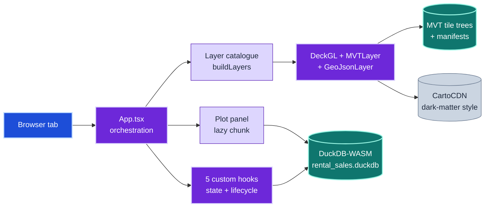
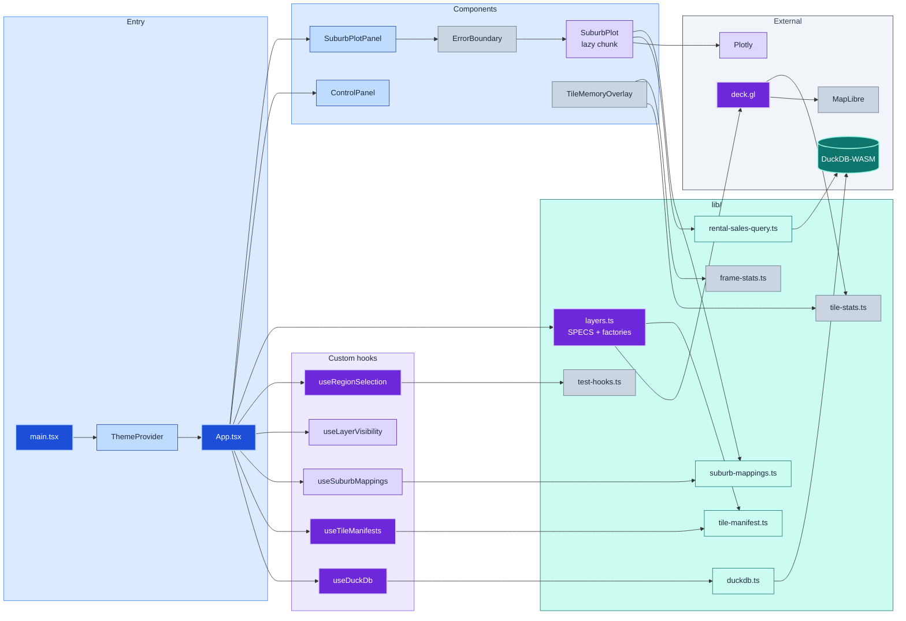
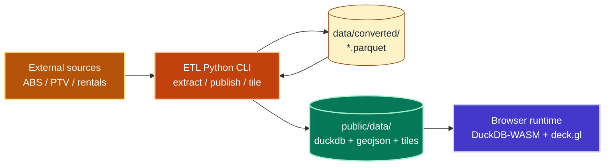
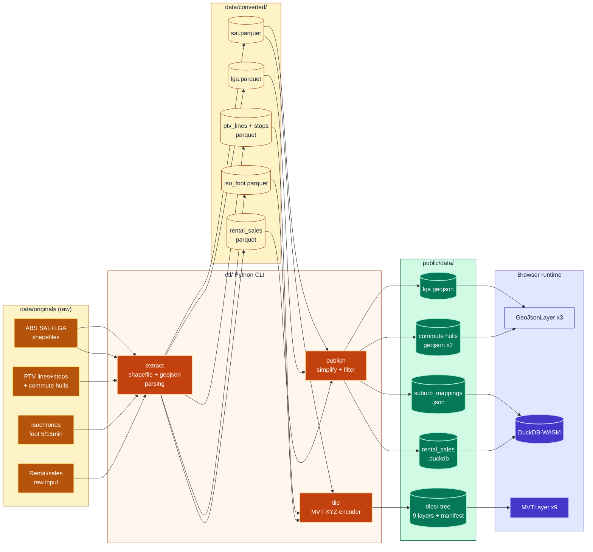
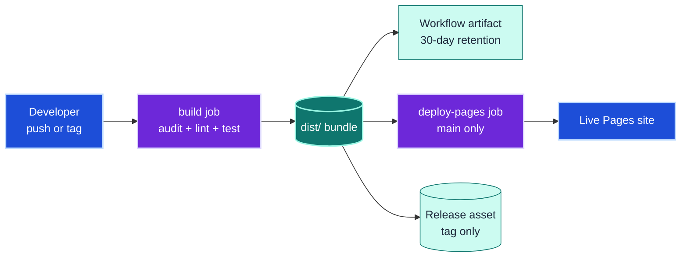
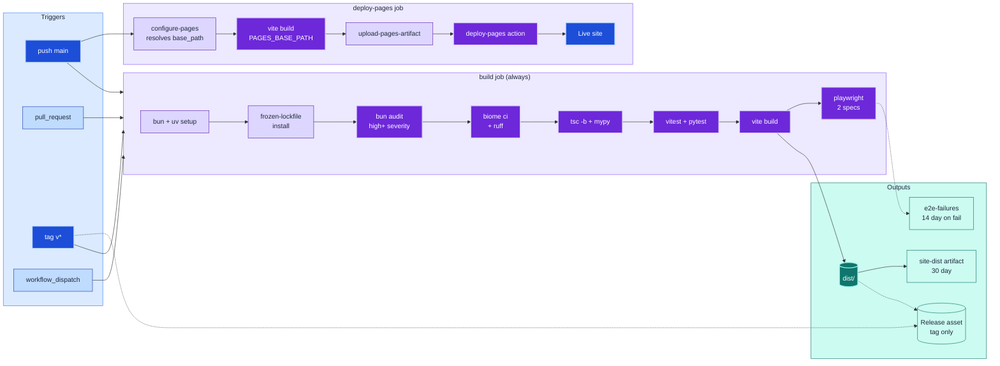
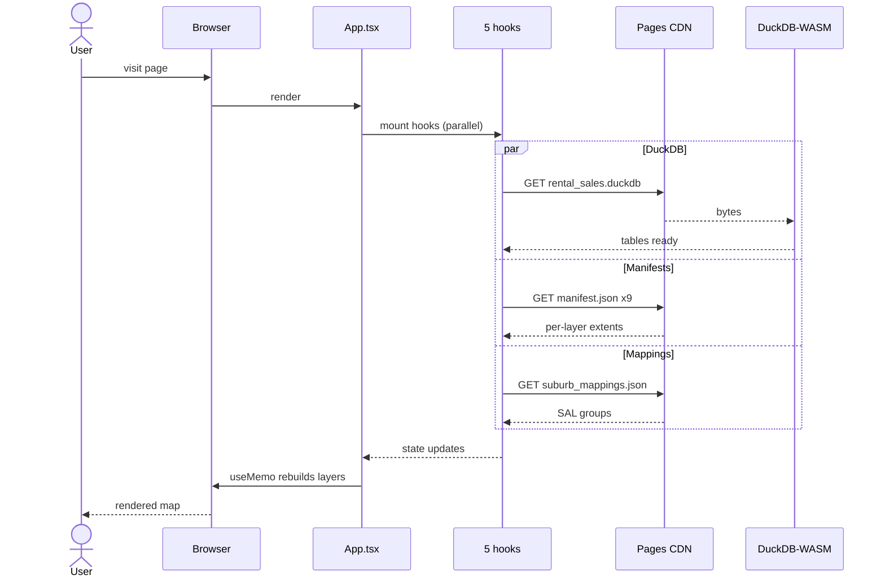
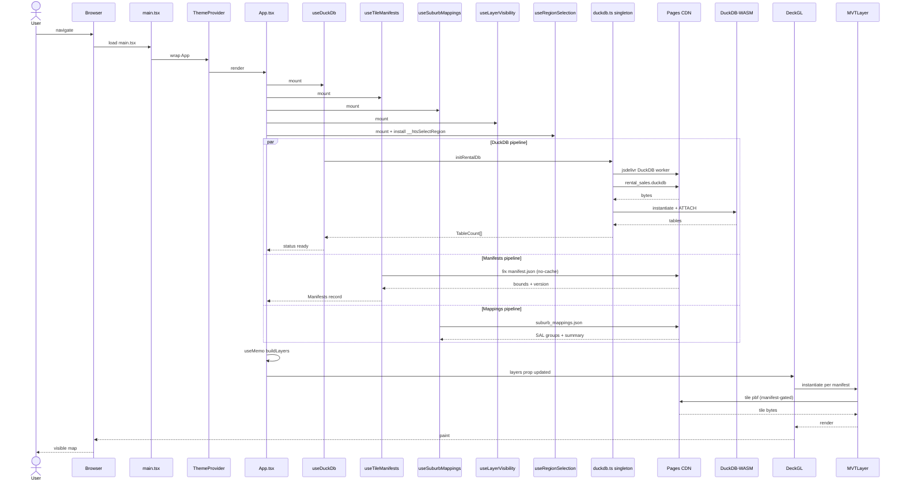
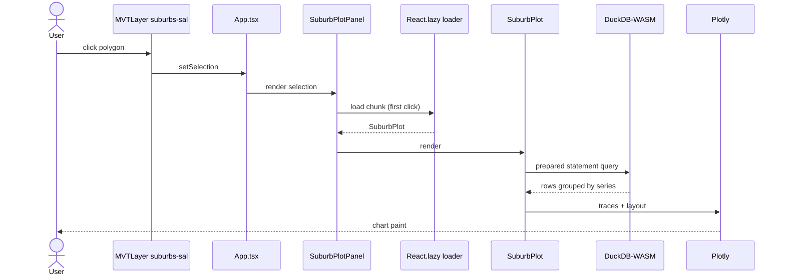
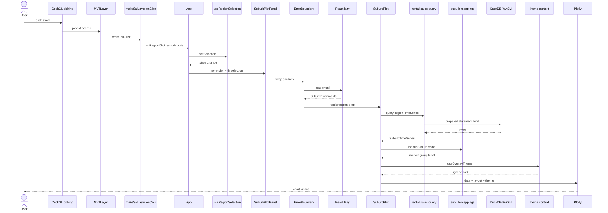

# Architecture

A single-page Vite + React 19 + TypeScript map app that visualises Melbourne
suburb rentals/sales over a multi-layer transit map. Rendering is GPU-driven
via deck.gl; the analytical store is a 3.5 MB DuckDB file pulled directly into
the browser via DuckDB-WASM. Data is produced by a Python ETL pipeline and
published as static assets that GitHub Pages serves verbatim — there is no
backend.

This document examines the system through five **architectural lenses**. Each
lens has a simplified overview (always visible) and a detailed reference
(collapsed). Both fences are live Mermaid; GitHub renders them inline.

- [1. Module architecture](#1-module-architecture) — what the frontend modules are and how they connect
- [2. Data flow](#2-data-flow) — how raw data becomes tiles + DuckDB + GeoJSON
- [3. Deployment](#3-deployment) — CI, artifacts, and Pages publication
- [4. Boot sequence](#4-boot-sequence) — what happens when the user loads the page
- [5. Suburb-click sequence](#5-suburb-click-sequence) — what happens when the user clicks a suburb

---

## 1. Module architecture

Frontend module layout after the recent refactor: `App.tsx` is now pure
orchestration, with state distributed across five custom hooks and the deck.gl
layer pipeline expressed as a typed catalogue rather than inline construction.

*Caption: top-level surfaces. The browser owns DuckDB and the tile pipeline directly — there is no server process.*

Detailed module map (28 nodes)

---

## 2. Data flow

The ETL is a Python `argparse` CLI under `etl/` with three command groups —
`extract` (raw → Parquet), `publish` (Parquet → GeoJSON/JSON in `public/data/`),
and `tile` (Parquet → MVT XYZ tile tree + `manifest.json`). Every output lands
under `public/data/`, which Vite copies verbatim into the deployed bundle. The
browser then consumes `.duckdb` via WASM, MVT tiles via deck.gl's `MVTLayer`,
and static GeoJSON via `GeoJsonLayer`.

*Caption: extract → intermediate Parquet → publish/tile → public/data → browser. The intermediate Parquet is a re-entrant cache — re-running publish/tile does not refetch sources.*

Detailed data flow (24 nodes)

---

## 3. Deployment

Two-job GitHub Actions workflow, artifact-based — no `gh-pages` branch. Every
run produces a 30-day workflow artifact. Push-to-`main` chains a Pages deploy
that re-builds with the dynamically-discovered base path. Tag pushes also
zip-and-upload to a GitHub Release.

*Caption: build always runs; Pages and Release fire conditionally on the ref.*

Detailed CI pipeline (24 nodes)

---

## 4. Boot sequence

What happens between page-load and first paint. The five custom hooks fire in
parallel from `App.tsx`'s render — each owns one async pipeline. Layers are
gated on their per-layer manifest, so `MVTLayer`s render incrementally as their
manifests resolve.

*Caption: three independent async pipelines fan out from one render. Layers paint as their manifests arrive — no all-or-nothing waterfall.*

Detailed boot sequence with tile fetches

---

## 5. Suburb-click sequence

The lazy-loading boundary: clicking a SAL polygon for the first time triggers a
~1.4 MB Plotly chunk download. Subsequent clicks are instant — only the
DuckDB query re-runs.

*Caption: first click pays the chunk-load cost (~700 KB gzipped); subsequent clicks skip directly to the query.*

Detailed suburb-click flow with mappings + theme

---

## Key invariants across lenses

A few cross-cutting facts that recur in multiple lenses:

- **Single source of truth for layers**: `src/lib/layers.ts` owns the catalogue (`SPECS`), the factory functions, the build, the tooltip, and the UI display order. Adding a layer is one row of config.
- **`public/data/` is the contract**: everything the frontend reads is a static asset under `public/data/`. The ETL never talks to a server; the frontend never talks to a database server. The deploy pipeline copies `public/data/` verbatim into `dist/`.
- **Manifest gating**: every MVT layer has a `manifest.json` listing the `(z,x,y)` keys with data. The frontend short-circuits out-of-manifest tile fetches before any HTTP request — keeps the network panel clean and avoids 404 noise.
- **DuckDB-WASM is the only "backend"**: rental/sales queries are JS-driven SQL against a 3.5 MB file the browser owns. There is no API surface to secure, throttle, or scale.
- **e2e drives selection via `window.__htsSelectRegion`**: WebGL canvas picking races headless Playwright's input event loop, so tests bypass the picking step. Manual users still exercise the full click → pick path.
