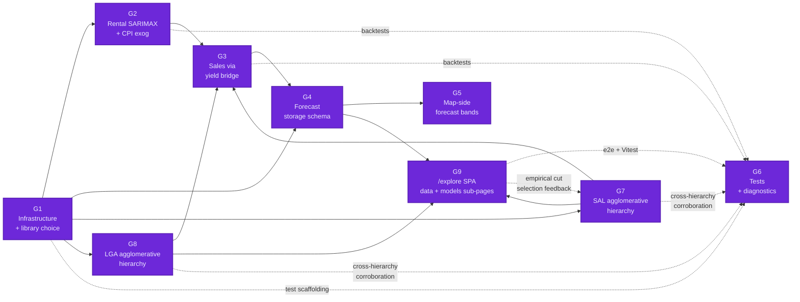
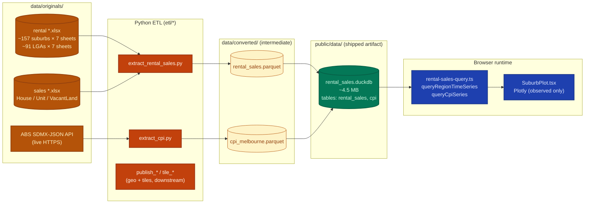
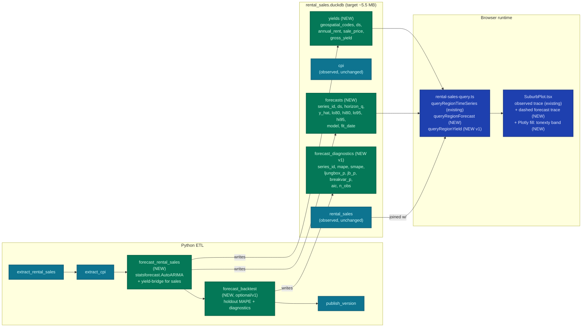
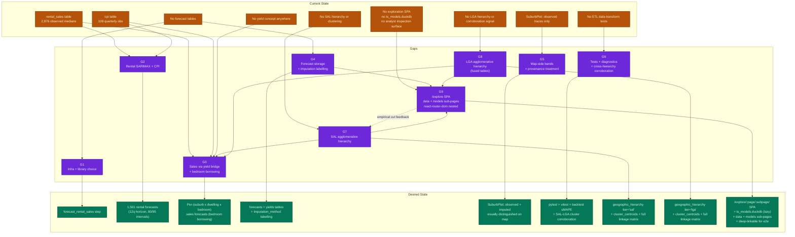
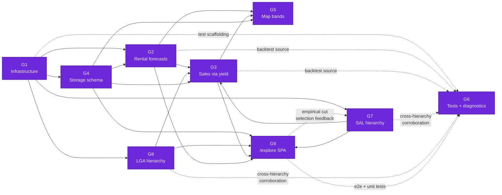

# SARIMAX-Driven Forecasts for Rental, Sales, and Yield Timeseries

<!-- WARNING: 6 external link(s) could not be independently verified by curl HEAD probe (Medium / Wiley / GlobalPropertyGuide bot-block or paywall). Search for LINK_NOT_VERIFIED or PAYWALLED to review. The remaining 47/53 cited URLs returned 200 OK; two highest-leverage claims content-verified via WebFetch (statsforecast issue #519 confirms exogenous-regressor scope; RBA RDP 2019-01 quotes rents momentum 0.7 and R²=0.80 verbatim). -->

## Execution Plan

<!-- TODO: Populated in Phase 4 (TDD Ticket Decomposition). Placeholder until Phase 2 refinement converges. -->

### Loop Runner Prompt

<!-- TODO: Self-contained /loop prompt embedding docs/specs/forecasts.md. Pending Phase 4. -->

### Progress

<!-- TODO: Roll-up table — one row per gap. Pending Phase 4. -->

### Done Criteria

<!-- TODO: Checklist — all tickets [x], all Success Measures pass, no UNRESOLVED markers. Pending Phase 4. -->

## Overview

Prebake SARIMAX-style forecasts for every rental and sales timeseries at ETL time and ship the predictions inside the existing `public/data/rental_sales.duckdb` artifact so the static DuckDB-WASM frontend can render observed history alongside forecast bands without any server-side compute. ABS Melbourne All-groups CPI (already in the same DuckDB file, quarterly, base 2011-12=100, currently extending to Mar 2026) serves as the **exogenous regressor** anchoring the environmental trend. Because sales data is **annual with only 11 observations per series** (vs. ~103 quarterly observations for rental), direct SARIMA on sales is statistically infeasible — the spec accordingly routes sales projections through a per-suburb **rental yield bridge** (the same equilibrium relationship the RBA's housing model formalises in [RDP 2019-01](https://www.rba.gov.au/publications/rdp/2019/2019-01/full.html)).

**Conceptual framing**: the operation is **nowcasting** (imputing the data-release lag between each variable's last observed datum and today using CPI as a leading indicator with real, published values for the gap window), with an **optional forward forecast** past today as a separate decision. Rental data ends Sep 2025 (lag ~3 quarters); sales data ends 2023 (lag ~3 annual periods); CPI is fresh (Mar 2026 and counting). CPI publishes faster than rental/sales, so for every period the bake needs to nowcast, the exog is already observed — much stronger signal than traditional forecasting.

The bake job runs in the existing Python ETL CLI (`etl/`) as a new step downstream of `extract_rental_sales` and `extract_cpi`, with a target wall-clock budget of **under 5 minutes** for all 2,876 forecastable median series. The frontend (`src/components/SuburbPlot.tsx`) extends its existing Plotly chart with dashed (nowcast) and dotted (forward forecast) traces plus shaded prediction-interval bands; the DuckDB query layer (`src/lib/rental-sales-query.ts`) gains a sibling query against a new long-format `forecasts` table. The user's "future-state recommendations" ask is met by a tiered MVP / v1 / v2 ladder embedded in the gap descriptions and explicitly surfaced in **G1** below.

**Gaps identified:**

- **G1: Forecasting infrastructure + modeling-library decision** — new `etl/steps/forecast_rental_sales.py` step + CLI wiring; pick `statsforecast.AutoARIMA` (fast, ~5 min for 2,876 series, only AutoARIMA family supports exog) vs `statsmodels.SARIMAX` (slow, full control). Three-tier future-state roadmap documented inline.
- **G2: Quarterly rental forecasts with CPI exogenous** — per-series SARIMA(X) fit on ~1,501 rental series (529 LGA + 972 suburb) with CPI as exog, 8–12 quarter horizon, Gaussian intervals in MVP.
- **G3: Annual sales forecasts via rental-yield bridge** — direct yields for 203/760 SAL-membership-matched suburbs; for the 557 unfunded SALs, walk up the G7 SAL agglomerative hierarchy to the smallest cluster with enough rental-data-bearing siblings, use cluster median rent as fallback input. Every yield row carries `source ∈ {suburb_direct, cluster_fallback}` + `cluster_id` + `cluster_level`.
- **G4: Forecast storage schema in DuckDB** — long-format `forecasts` table inside the existing `rental_sales.duckdb`, with `series_id`, `ds`, `horizon_q`, `y_hat`, prediction-interval bounds, `model`, `fit_date`; budget added file size < +1 MB.
- **G5: Frontend rendering of forecast bands** — extend `SuburbPlot.tsx` with dashed forecast traces + Plotly `fill: 'tonexty'` shaded interval bands; extend `rental-sales-query.ts` with a sibling query; mark observed-vs-forecast boundary and (where applicable) cluster-fallback provenance visually.
- **G6: Test coverage + diagnostics + backtest** — first non-trivial pytest tests for ETL data logic (in-memory DuckDB, no mocking per project rules); Vitest test for forecast query; bake-time backtest holdout writing per-series MAPE/sMAPE and Ljung-Box/JB/heteroscedasticity p-values to a sidecar `forecast_diagnostics` table; **cluster-rental-vs-LGA-rental corroboration check** (G7 cluster medians compared to LGA rental at the matching dendrogram level; divergence flagged informationally).
- **G7: SAL geographic agglomerative hierarchy** — build a SAL-only dendrogram from spatial features (centroids, adjacency, area; not rental/sales data) using GeoPandas + scipy `cluster.hierarchy`; persist as `sal_hierarchy` + `sal_cluster_centroids` tables in `rental_sales.duckdb`; consumed by G3 for yield fallback, by G6 for LGA corroboration, and by v1 hierarchical reconciliation.
- **G8: LGA geographic agglomerative hierarchy** — second, parallel agglomerative construction at LGA scale (80 Victorian LGAs). Same adjacency-constrained linkage as G7. Writes into the **fused** `geographic_hierarchy` + `cluster_centroids` tables alongside G7 (`tier='lga'` discriminator). Provides coarser-tier fallback for SALs where the smallest G7 cluster still has too few rental-bearing siblings, plus the cross-hierarchy corroboration signal G6 consumes.
- **G9: `/explore/:page/:subpage/` multi-page exploration SPA** — new `/explore` route hosting a multi-page SPA with **react-router-dom** nested routes and a side-panel menu. Two top-level `:page` groupings: `data` (production forecasts, yields, hierarchy, diagnostics, reconciliation — tables over `rental_sales.duckdb`) and `models` (dendrogram explorer, SARIMAX decomposition viewer, timeseries explorer, yield-distribution viewer — over a new intermediate `ts_models.duckdb` lazy-loaded only when a `models/*` sub-page is opened). Every sub-page is a deep-linkable URL the Playwright slug-taxonomy can iterate over.



**Recommended implementation order:** G1 → (G4 ∥ G7 ∥ G8) → G2 → G3 → (G5 ∥ G9) → G6. G4/G7/G8 are foundational. G5 (map) and G9 (`/explore` SPA) consume the same DuckDB tables but render different surfaces — parallelisable. G9's `models/dendrogram` sub-page feeds back into G7 via empirical cut-level selection (a post-bake decision recorded as its own Phase 4 ticket).

## Current State

### Data inventory (confirmed by direct DuckDB query)

The user's "3,247 timeseries" claim is close but not exact. The actual counts in `public/data/rental_sales.duckdb` today:

| `data_type` | `geospatial_type` | `statistic` | # Series | Quarterly buckets | Date range | Min obs/series | Median | Max |
|---|---|---|---:|---:|---|---:|---:|---:|
| rental | lga | median | 529 | 106 | 1999-06-01 → 2025-09-01 | 1 | 106 | 106 |
| rental | suburb | median | 972 | 103 | 2000-03-01 → 2025-09-01 | 1 | 103 | 103 |
| sales | suburb | median | 1,375 | 11 (annual) | 2013-01-01 → 2023-01-01 | 3 | 11 | 11 |
| rental | lga | count | 529 | 106 | (same) | — | — | — |
| rental | suburb | count | 972 | 103 | (same) | — | — | — |

**Forecastable median series: 2,876.** The `statistic='count'` series (1,501 of them, also rental-only) are sample-size metadata, not forecast targets — but become an exogenous candidate for weighting fit quality.

**Sample-size adequacy** (% of series with ≥ N non-null obs, the practical SARIMA minimum):

| `data_type` | `geospatial_type` | ≥40 obs | ≥80 obs | ≥100 obs | Total |
|---|---|---:|---:|---:|---:|
| rental | lga | 475 (90%) | 449 (85%) | 408 (77%) | 529 |
| rental | suburb | 956 (98%) | 932 (96%) | 885 (91%) | 972 |
| sales | suburb | **0 (0%)** | 0 | 0 | 1,375 |

The sales row is the heart of why sales forecasts must be derived, not directly modelled.

**CPI table** (`cpi`): 109 quarterly observations, 1999-03-01 → 2026-03-01, index range 47.67 → 101.79 (ABS base 2011-12 = 100.0). CPI is refreshed every ETL run from the live ABS SDMX-JSON API. Because CPI publishes **faster than rental and sales** (Q1 CPI is out ~end of April; Q2 ~end of July; etc.), CPI carries **real, observed values for every quarter in the nowcast window** — at today's bake (May 2026), CPI for Q4 2025 + Q1 2026 (and imminently Q2 2026) is published, while rental ends Sep 2025 and sales ends 2023. This makes CPI the natural leading-indicator exog for **nowcasting** the rental/sales lag rather than forecasting it — see G2's horizon ADR for the framing.

**Yield-join footprint** (corrected after direct measurement against `suburb_mappings.json`):

- 760 sales suburb SALs total; 203 rental suburb SALs total (rental groups span multiple SALs — 140 distinct rental `geospatial_codes` strings, of which 55 are multi-SAL groups).
- **Naïve string-match on `geospatial_codes`**: only 85 suburbs join (the string `"20002"` doesn't match the rental group string `"20616-20002"`).
- **SAL-membership lookup via `suburb_mappings.json`**: each sales SAL is one-to-one with a `salCodes` entry; if that entry carries a `rental.groupCodes`, the sales SAL inherits the rental group's median rent. **Result: 203 of 760 sales SALs (27%)** have a direct rental match this way.
- **Remaining 557 sales SALs** have no rental data at SAL level. Reaching them requires either (a) a SAL → LGA spatial join (the SAL geojson does **not** carry `LGA_CODE24`, so this is a new ETL step using GeoPandas `sjoin`), or (b) an explicit "no sales forecast" marker on the frontend.
- LGA-tier rental exists for **79 LGAs** with `dwelling_type='all', bedrooms='all'` data. A spatial join can route most of the 557 missing SALs to one of these 79 LGAs.

### Architecture



### Frontend rendering today

`SuburbPlot.tsx` already paints:
- **Rental tab**: every `(dwelling_type, bedrooms)` median trace on a date x-axis × AUD/week y-axis.
- **Sales tab**: every dwelling-type median trace on a date x-axis × AUD y-axis.
- **CPI overlay**: dashed grey line on a secondary right-axis, shared across both tabs (see `buildCpiTrace`, `rental-sales-query.ts:123` and `SuburbPlot.tsx:337`).
- No forecast traces. No prediction intervals. No yield computation anywhere in the repo (confirmed: `grep -ri yield` returns only the unrelated tile generator and English-word matches).

### Existing tests (the quality-bar starting line)

- **`etl/tests/test_cli_smoke.py`** — 3 tests, parser wiring only. **Zero** unit tests for any `extract_*` data-transformation logic.
- **`src/`** — zero Vitest files (`Glob src/**/*.test.*` returns empty).
- **`e2e/`** — 2 specs (`routes.spec.ts`, `suburb-click.spec.ts`); the latter drives the rental/sales chart but does not assert on data values.

### Pre-existing bug worth fixing in flight

`extract_cpi.py:7` correctly states base period **2011-12 = 100**. `rental-sales-query.ts:111` comment incorrectly says "base 2023-24 = 100". One-line comment fix; flag in G5.

## Desired State

### Pipeline



### Modeling stack (MVP defaults; alternates surfaced as ADRs)

- **Library**: [`statsforecast`](https://github.com/Nixtla/statsforecast) (Nixtla) — Numba-compiled AutoARIMA, parallelism via `n_jobs=-1`, ~20× faster than `pmdarima`, ~4× faster than `statsmodels` for the same problem family. Independently verified that **only `AutoARIMA` and `MSTL-AutoARIMA` support exogenous regressors** ([statsforecast issue #519](https://github.com/Nixtla/statsforecast/issues/519)).
- **Rental models** (G2): `AutoARIMA(season_length=4)` per series, `exog=cpi` column. Stepwise AIC chooses (p,d,q)(P,D,Q,4) per series automatically. Forecast horizon: 12 quarters (3 years).
- **Sales models** (G3): no direct SARIMA; pre-compute per-suburb gross yield = `(rental_all_all_median × 52) / sales_median`, project the yield series with `AutoARIMA(season_length=1)` + CPI exog, then derive `sales_forecast = (rental_forecast × 52) / yield_forecast`. Forecast horizon: 3 annual periods (≈ matches 12-quarter rental horizon).
- **Prediction intervals** (MVP): Gaussian 80% and 95% from the library's `level=[80, 95]` argument. **v1 upgrade**: `ConformalIntervals(method='conformal_distribution', n_windows=5)` for calibrated, distribution-free intervals ([Nixtla conformal tutorial](https://nixtlaverse.nixtla.io/statsforecast/docs/tutorials/conformalprediction.html)).
- **Hierarchical reconciliation** (v1 stretch): `hierarchicalforecast.MinTrace(method='mint_shrink')` to enforce coherence between "suburb-all" and "suburb-house + suburb-unit" forecasts ([hierarchicalforecast docs](https://nixtlaverse.nixtla.io/hierarchicalforecast/index.html)).
- **Backtest** (G6): drop last 4 quarters (rental) / 2 years (sales-via-yield), refit, compute sMAPE + Ljung-Box(4,8) + Jarque-Bera + breakvar, write to `forecast_diagnostics`.

### Future-state recommendation tiers

| Tier | Adds | Wall-clock budget | Value |
|---|---|---:|---|
| **MVP** | AutoARIMA + CPI exog + Gaussian intervals + yield bridge + flat `forecasts` table | <5 min | Falsifiable forecast for every series, end-to-end |
| **v1** | Conformal intervals + MinTrace reconciliation + diagnostics table + backtest sMAPE + log-transform sales | <10 min | "Trustworthy by an economist" output |
| **v2** | Chow-Lin annual→quarterly sales disaggregation (via [`tempdisagg`](https://github.com/jaimevera1107/tempdisagg)) + MIDAS regression for cross-frequency CPI + neural ensemble baseline ([`neuralforecast.NHITS`](https://nixtlaverse.nixtla.io/statsforecast/index.html)) + per-series automated model selection + CPI scenario sensitivity panel (RBA upper/lower band) | <30 min | Econometrically defensible; matches RBA & Khemka et al. (2024) cascade methodology |

This three-tier ladder maps directly onto the user's "future-state recommendations" ask. The spec implements MVP in Phase 4 tickets; v1/v2 land as `<!-- ROADMAP: -->` comments in G1's References for a future spec.

## Gap Analysis

### Gap Map



### Dependencies



**Recommended implementation order:** G1 (lay the step + CLI + library choice) → (G4 ∥ G7 ∥ G8) — forecast table shape + both hierarchies in fused tables + raw linkage matrices in `ts_models.duckdb` — → G2 (rental forecasts) → G3 (sales via yield bridge, consumes G2 + G7 + G8) → (G5 ∥ G9) — map-side bands and `/explore` SPA parallelisable → G6 (tests, diagnostics, cross-hierarchy corroboration, full slug-taxonomy e2e across every `/explore/:page/:subpage/`). The G9 → G7 dotted edge represents the **empirical cut-level selection** as a post-bake Phase 4 ticket: once `/explore/models/dendrogram` is rendering, an analyst inspects each tier's dendrogram and either confirms the provisional cuts or feeds new values back into the G7 bake step.

### G1: Forecasting infrastructure + modeling-library decision

**Current:** No forecasting code exists in the repo. The Python ETL (`etl/`) has `extract_*`, `publish_*`, and `tile_*` command groups but no `forecast` group. The `etl/cli.py` wiring follows a strict argparse-with-`_help`-closure pattern (per `.claude/rules/python/cli.md`). The Makefile has `make etl-all` driving subprocess-isolated step execution; rental-sales and CPI extract are reachable only via that target or direct `uv run -m etl extract rental-sales` invocation.

**Gap:** Introduce a new `forecast` command group with a `bake` subcommand that runs after `extract_rental_sales` and `extract_cpi` succeed and writes its outputs into the existing `public/data/rental_sales.duckdb`. The step needs a deterministic seed, a `--horizon-q` argument, a parallelism knob (`--n-jobs`), and idempotent re-runnability (drop-and-recreate the `forecasts` table). The library choice — `statsforecast` vs `statsmodels.SARIMAX` + `joblib` — is the foundational ADR because it shapes G2, G3, and G6 (parallelism story, exogenous API, residual diagnostics availability).

**Output(s):**
- `etl/steps/forecast_rental_sales.py` (Python) — `run(*, input_duckdb, output_duckdb, horizon_q, n_jobs, seed) -> int` entry point following the existing step module convention (`extract_cpi.py` is the cleanest template).
- `etl/cli.py` (Python) — new `forecast` parser group + `bake` leaf subcommand + `status` leaf for read-only artifact inspection (per `.claude/rules/python/cli.md` visibility-verb convention).
- `etl/__init__.py` / `etl/__main__.py` — register the new step in `PIPELINE_STEPS` between `extract_cpi` and `publish_version`.
- `pyproject.toml` — add `statsforecast >= 1.7` (or `statsmodels >= 0.14` per ADR) and `numpy >= 1.24` as runtime dependencies; ensure `numba` lands transitively only on the bake path so wheel size for non-bake users (e.g. `make etl-all-publish`) stays small.
- `Makefile` — new `make forecast-bake` target wrapping `uv run -m etl forecast bake` with sensible defaults; new `make etl-status` row showing forecast freshness.
- `data/converted/forecasts_meta.json` (intermediate checkpoint) — written by the bake step so re-runs can short-circuit if input mtimes haven't changed (per `.claude/rules/caching.md`).

**References:**
```python
# etl/steps/forecast_rental_sales.py — sketch
import logging
from pathlib import Path
import duckdb
import pandas as pd
from statsforecast import StatsForecast
from statsforecast.models import AutoARIMA

log = logging.getLogger("etl.steps.forecast_rental_sales")

def _load_long_frame(con: duckdb.DuckDBPyConnection) -> pd.DataFrame:
    return con.execute("""
        SELECT
            data_type || '|' || geospatial_type || '|' || geospatial_codes
              || '|' || dwelling_type || '|' || bedrooms AS unique_id,
            time_bucket AS ds,
            value AS y
        FROM rental_sales
        WHERE statistic = 'median' AND value IS NOT NULL
    """).fetchdf()

def _load_cpi(con: duckdb.DuckDBPyConnection) -> pd.DataFrame:
    return con.execute("SELECT time_bucket AS ds, index_value AS cpi FROM cpi").fetchdf()

def run(*, output_duckdb: Path, horizon_q: int = 12, n_jobs: int = -1, seed: int = 42) -> int:
    con = duckdb.connect(str(output_duckdb))
    try:
        observations = _load_long_frame(con)
        cpi = _load_cpi(con)
        # Merge CPI as exog onto the rental series; sales gets the yield-bridge treatment in G3.
        merged = observations.merge(cpi, on="ds", how="left")
        # (Continued in G2 References.)
        ...
```

**ADRs:**

#### ADR: Modeling library choice

| Option | Pros | Cons |
|---|---|---|
| `statsforecast.AutoARIMA` (Nixtla) **← chosen** | ~5 min for 2,876 series with `n_jobs=-1`; Numba-compiled; stepwise per-series order selection; conformal intervals first-class | Only AutoARIMA & MSTL-AutoARIMA accept `exog`; cannot fix one (p,d,q)(P,D,Q,s) order globally; bundled diagnostics are thinner than statsmodels |
| `statsmodels.SARIMAX` + `joblib.Parallel` | Full control of order spec; rich residual diagnostics (Ljung-Box, JB, breakvar via `results.test_*`); canonical reference impl | ~30 min on 8 cores even at favourable per-fit times; needs `OMP_NUM_THREADS=1` to avoid BLAS over-subscription |
| `pmdarima.auto_arima` | API close to R `forecast::auto.arima`; still maintained (v2.1.1, Nov 2025) | ~20–30× slower than statsforecast; same `exog`-on-ARIMA-family-only constraint; less actively developed |

**Decision:** `statsforecast.AutoARIMA` with `n_jobs=-1`, `season_length=4` for rental and `season_length=1` for sales-via-yield, `level=[80, 95]` for prediction intervals. Added to `pyproject.toml` as a runtime dep alongside its transitive `numba`. The bake step uses the long-DataFrame interface (`unique_id`, `ds`, `y`, plus the `cpi` column as exog) and passes `X_df` for the forecast-horizon exog.

**Rationale:** Three reasons in priority order: (1) the wall-clock budget — 5 min for 2,876 series on 8 cores fits inside `make ci` without restructuring the pipeline cadence; the statsmodels path at ~30 min would force the bake into a nightly cron rather than a build-time step. (2) Conformal prediction intervals are first-class in statsforecast via `ConformalIntervals`, which is the v1 upgrade lane this spec already maps onto — sticking with one library keeps the MVP → v1 transition mechanical. (3) The exog-only-on-AutoARIMA constraint ([statsforecast issue #519](https://github.com/Nixtla/statsforecast/issues/519), verbatim verified) is not blocking: we are passing CPI as exog and accepting stepwise per-series order selection rather than fixing a global order — appropriate for 2,876 heterogeneous suburb/dwelling/bedroom series anyway.

**Cascading implications (recorded here for future refinement):**
- **G2 ADR (CPI horizon shortfall)** — Option 1 ("project CPI with univariate AutoARIMA") is now the natural default because `X_df` requires us to provide the future-exog frame ourselves; Options 2 and 3 (RBA scrape, multi-scenario) remain viable variations but require additional infrastructure.
- **G1 ADR (bake re-run semantics)** — with a ~5-min budget, drop-and-recreate becomes cheap; the audit motivation for vintage-append remains the only reason to consider it.
- **G6 (diagnostic depth)** — `statsforecast` does not bundle Ljung-Box / Jarque-Bera / breakvar. Three downstream options: (a) accept thinner diagnostics + use `StatsForecast.cross_validation()` rolling-window sMAPE/MAE/MAPE instead, (b) add `statsmodels` as a v1-only dep for a 5-10% stratified sample diagnostic pass, (c) defer diagnostics entirely to v1. Will surface as an explicit ADR if and when G6 tickets reach refactor stage.

#### ADR: Bake-step idempotency / re-run semantics — drop and recreate

| Option | Pros | Cons |
|---|---|---|
| **Drop-and-recreate the `forecasts` table every run (← chosen)** | Simple; matches `extract_cpi` precedent; deterministic CI; cheap inside 5-min budget | No history of past forecast vintages |
| Append vintage rows keyed by `fit_date` | Enables cross-vintage comparison in `/explore` | Competes with MLFlow when adopted; doubles file size per run; needs explicit GC |
| Cache by input mtimes | Skips work when nothing changed | Sentinel-file invalidation logic is hard to test; defer to v1 |

**Decision:** **Drop and recreate** the `forecasts` table at the start of every bake. Pattern: `DROP TABLE IF EXISTS forecasts; CREATE TABLE forecasts (...); INSERT INTO forecasts ...` — single transaction-scoped sequence. Same shape for the supporting tables (`yields`, `forecast_diagnostics`, `forecast_diagnostics_corroboration`). No `--vintage-append` flag, no `fit_date`-keyed history, no mtime cache sentinel.

**Rationale:** (a) Simplest possible shape that's correct — matches the existing `extract_cpi.py` precedent (line 175: `con.execute("DROP TABLE IF EXISTS cpi")`) and keeps re-runs deterministic. The 5-min budget makes a fresh rebuild cheap; nothing here justifies cleverness. (b) **Experiment vintaging is the natural fit for MLFlow** (or similar experiment-tracking tooling), which is on the deferred roadmap — explicitly noted by the user during ADR resolution. Building a homemade `--vintage-append` mechanism today would either be ripped out when MLFlow lands (wasted work + migration headache) or, worse, would compete with MLFlow's mechanism (two sources of truth, divergent UX, painful reconciliation). The principled call is: drop+recreate today, MLFlow tomorrow, no half-version in between. (c) The mtime-cache option is also genuinely useful but has a thorny invalidation-correctness story (what counts as an "input" — Parquet mtime alone? library version? Python version? linkage-matrix mtime? — and how is each tested?); it doesn't pay for itself at MVP scale and can be revisited in v1 if bake time becomes a real CI concern. (d) The existing `forecasts_meta.json` checkpoint (G1 deliverable) preserves bake provenance per run (seed, library versions, CPI vintage, bake_date, today_at_bake) so re-baked artefacts are self-describing without needing in-table vintaging.

**Cascading implications:**
- `etl/steps/forecast_rental_sales.py` opens each run with `DROP TABLE IF EXISTS forecasts; ...` for every forecast-related table it writes (`forecasts`, `yields`, `forecast_diagnostics`, `forecast_diagnostics_corroboration`). The G7/G8 hierarchy steps similarly drop+recreate `geographic_hierarchy` and `cluster_centroids`.
- `forecasts_meta.json` is the **only** vintage record at MVP — it overwrites each run but carries timestamped contents (bake_date, today_at_bake, library_versions, CPI max date, seed). Git history of this file (if committed) captures the bake-over-bake delta for any analyst who wants to walk back through time.
- No `fit_date` column is added beyond the existing scalar in the forecasts DDL (which records the single current bake's timestamp — useful for the frontend "as of YYYY-MM" footer, not for cross-bake comparison).
- When MLFlow (or equivalent experiment-tracking tooling) is later adopted, it owns: vintage IDs, run metadata, per-vintage forecast snapshots, vintage comparison UX. The `forecasts` table itself stays single-vintage; MLFlow manages the historical projection externally.

### G2: Quarterly rental forecasts with CPI exogenous

**Current:** All 1,501 rental median series (529 LGA + 972 suburb, 103–106 quarterly obs each) exist in `rental_sales.duckdb` as observed history. The CPI table is right alongside them. There is no forecast layer, no exogenous regression, and the `SuburbPlot.tsx` rental tab paints only observed history.

**Gap:** For each rental series, fit `AutoARIMA(season_length=4)` (or its statsmodels equivalent per the G1 ADR) with the matching CPI quarterly index as `exog`. CPI extends two quarters past the rental cutoff (Mar 2026 vs Sep 2025), giving the near forecast horizon "free" exog values; for quarters beyond CPI's reach, project CPI itself with a separate univariate AutoARIMA(season_length=4) one-off so every quarter in the forecast window has an `exog` value. Output: 12-quarter forecast horizon per series, point estimate + 80% + 95% Gaussian intervals (MVP) / conformal intervals (v1).

**Output(s):**
- `etl/steps/forecast_rental_sales.py` (Python, continued from G1) — the rental modeling loop body. Writes rows to `forecasts` table with `model='autoarima_cpi_q'`.
- `etl/tests/test_forecast_rental_sales.py` (Python, also feeds G6) — synthetic 100-quarter series + synthetic CPI through the full bake step, asserting (a) every input series gets exactly `horizon_q` forecast rows, (b) intervals are ordered `lo95 < lo80 < y_hat < hi80 < hi95`, (c) bake is deterministic given a seed.
- (Optional v1) `forecast_diagnostics` insert path inside the same step — per-series Ljung-Box(4), Ljung-Box(8), Jarque-Bera, breakvar p-values + AIC. Requires statsmodels even if main fit is statsforecast.

**References:**
```python
# G2 modeling loop — extends the G1 sketch
def _bake_rental(observations: pd.DataFrame, cpi: pd.DataFrame, horizon_q: int) -> pd.DataFrame:
    # Filter to rental rows only; sales handled by G3.
    rental = observations[observations.unique_id.str.startswith("rental|")].copy()
    rental = rental.merge(cpi, on="ds", how="left")

    # Project CPI itself past its last obs so every forecast quarter has an exog value.
    cpi_model = StatsForecast(models=[AutoARIMA(season_length=4)], freq="Q-DEC")
    cpi_fc = cpi_model.forecast(df=cpi.rename(columns={"cpi": "y"}).assign(unique_id="cpi"),
                                h=horizon_q, level=[80, 95])
    cpi_horizon = pd.concat([cpi[["ds", "cpi"]],
                             cpi_fc.rename(columns={"AutoARIMA": "cpi"})[["ds", "cpi"]]])

    # Multi-series fit; future_df carries the projected CPI exog rows for the horizon.
    sf = StatsForecast(models=[AutoARIMA(season_length=4)], freq="Q-DEC", n_jobs=-1)
    fc = sf.forecast(df=rental[["unique_id", "ds", "y", "cpi"]],
                     h=horizon_q,
                     level=[80, 95],
                     X_df=cpi_horizon)  # Nixtla calls this the "future exogenous" frame
    return fc

# DuckDB write — long-format, one row per (series_id, ds)
def _write_forecasts(con, fc: pd.DataFrame, model_name: str, fit_date: dt.date) -> None:
    con.register("fc_src", fc.assign(model=model_name, fit_date=fit_date))
    con.execute("INSERT INTO forecasts SELECT * FROM fc_src")
```

**ADRs:**

#### ADR: Horizon framing — nowcast (dynamic) + optional forward forecast

The original framing ("forecast 8 / 12 / 20 quarters") missed the actual problem. The rental data lags by ~3 quarters (ends Sep 2025); the sales data lags by ~2–3 annual periods (ends 2023); CPI is **fresh** (extends to Mar 2026 and is updated quarterly via the live ABS SDMX-JSON API in `etl/steps/extract_cpi.py`). What the spec is producing is not a forecast in the traditional sense — it's a **nowcast**: filling the data-release lag between each variable's last observed datum and the present, using CPI as a leading indicator whose values for the gap window are **already published**.

**Decision:** Split horizon into two distinct, separately-configurable concepts:

1. **Nowcast horizon** (always on, dynamic): per-series, computed at bake start as `horizon_nowcast = ceil((today - last_observed_date) / freq)`. Bake writes one forecast row per quarter (rental) / year (sales) between each series' last observation and `today`. The CPI exog for every nowcast period is the **real, published** CPI value (CPI publishes faster than rental/sales — Q1 CPI is out ~end of April, Q2 ~end of July, etc.). No CPI projection needed for the nowcast window; the exog is observed.

2. **Forward-forecast horizon** (`N = 0` in MVP — resolved): no forward extrapolation past `today` in production. The bake's `--forecast-h` CLI flag defaults to `0`. Schema, enum values, and the `cpi_is_projected` column remain in place as forward-extensibility surface; setting `--forecast-h N` for `N > 0` later (likely as a v1 enhancement, configurable per bake run) adds `forecast_*` rows without re-architecting. `/explore/models/timeseries` can also run local-only forward-forecast experiments by setting `--forecast-h N` against a local `rental_sales.duckdb` without affecting production.

**At today's date (2026-05-13), the nowcast horizons evaluate to:**
- Rental (quarterly, ends Sep 2025): 3 quarters — Q4 2025, Q1 2026, Q2 2026.
- Sales (annual, ends 2023): 3 years — 2024, 2025, 2026.
- (Numbers will shift over time. The bake reads `today` and computes; no static commitments.)

**Rationale:** (a) The user's framing is right — we have real CPI for the gap window, so the operation is statistically nowcasting (using a contemporaneous-in-time leading indicator), not forecasting (projecting all variables into unobserved territory). (b) Calling it nowcasting in the spec, the column names, and the frontend rendering matters — it sets honest expectations about the strength of the signal. Nowcast accuracy is structurally better than forecast accuracy because the exog has zero projection uncertainty. (c) A dynamic horizon means the bake is self-updating: every ETL run picks up the latest CPI and produces the smallest nowcast window the data freshness allows. As new rental/sales releases land, the nowcast shrinks automatically until those quarters become observed and disappear from `forecasts` entirely. (d) The forward-forecast horizon is held at `N = 0` in MVP — production rendering is honest about the difference between "we filled the data lag with strong evidence" and "we extrapolated past the joint observed window." Setting `--forecast-h > 0` is available locally for experimentation in `/explore/models/timeseries` and remains a v1 enhancement path; the schema already accommodates it without rework.

**Cascading implications:**
- **G2 ADR 2 (CPI horizon shortfall)** is resolved by extension: the nowcast window has no CPI shortfall (real CPI exists for every nowcast period); the shortfall question only applies to the forward-forecast horizon if/when the next ADR sets it > 0. See that ADR below.
- **G3 (sales nowcast)** mirrors: per-suburb annual sales nowcast for 2024, 2025, 2026 via the quarterly rental nowcast aggregated to annual, divided by per-cluster yield. Bedroom borrowing applies identically.
- **`imputation_method` enum** gets nowcast-specific variants: `nowcast_sarima_cpi`, `nowcast_yield_bridge_direct`, `nowcast_yield_bridge_sal_cluster`, `nowcast_yield_bridge_lga_cluster`, `nowcast_bedroom_borrowed`, `nowcast_direct_sarima_low_n`. The plain `forecast_*` variants apply only to rows past today (when the forward horizon is > 0).
- **`forecasts` table** gains an `is_nowcast BOOLEAN NOT NULL` column for fast filtering (or, equivalently, the row is nowcast iff `ds <= today`).
- **G5 visual treatment** distinguishes nowcast (e.g. dashed darker line + ~80% fill alpha — high confidence because exog is real) from forward forecast (dotted lighter line + ~40% fill alpha — lower confidence because exog is projected). Observed remains solid.
- **G9 `/explore/data/forecasts`** filter panel adds an "Imputation kind" facet: `observed` / `nowcast` / `forecast` for fast slicing.

#### ADR: Handling CPI horizon shortfall (during forward-forecast window only)

The CPI shortfall problem is now contained: it only fires when the forward-forecast horizon (per the follow-up ADR) is > 0, and CPI's own published horizon falls short of the requested forward periods. Within the nowcast window, CPI is already published — no shortfall.

| Option | Pros | Cons |
|---|---|---|
| **Project CPI with univariate AutoARIMA (← chosen for any forward-forecast quarters)** | Internally consistent; same library as the rental/sales SARIMAX; intervals propagate naturally | Compounds uncertainty — projected CPI's intervals widen forward-forecast bands |
| Scrape RBA Statement on Monetary Policy CPI projections | External calibration; matches policy-maker expectations | Fragile scrape; licence question; only RBA's central path, not their bands |
| Multi-scenario forecast under 3 CPI paths | Sensitivity panel | Triples bake + storage; complex UI |

**Decision:** When the forward-forecast horizon (next ADR) is > 0 AND that horizon extends beyond CPI's last observed quarter, project CPI itself via a single univariate `AutoARIMA(season_length=4)` and use the projected mean as the forward exog. Record per-row in `forecasts.cpi_is_projected BOOLEAN` so diagnostic queries can separate nowcast-grade confidence from forecast-grade confidence.

**Rationale:** The nowcast framing makes this ADR almost vestigial — at today's bake (May 2026) with CPI through Mar 2026, even a 4-quarter forward forecast would have real CPI for Q1 + Q2 2026 (already published or imminent) and need projection only for Q3 + Q4. Univariate AutoARIMA matches the rest of the library stack and propagates uncertainty correctly. The scenario approach (Option 3) remains a stretch idea documented in the future-state ladder under v2 — surfacing CPI-path sensitivity is genuinely useful, but it's a multiplicative bake-time + frontend-complexity cost the MVP doesn't need.

### G3: Annual sales forecasts via rental-yield bridge

**Current:** The 1,375 sales median series each have **at most 11 annual observations** (2013–2023). Direct SARIMA on 11 data points is statistically meaningless (the season-length-1 AR(1) variant degenerates near a flat-line extrapolation; no library will warn you about it because the fit technically succeeds). The frontend renders these annual points alongside quarterly rental on the same date axis with no interpolation. No yield concept exists in the codebase — `grep -r yield` returns only the unrelated tile-coordinate generator.

**Gap:** Derive a per-suburb gross rental yield from the observed history (`annual_rent ≈ rental_all_all × 52` divided by `sales_median` at the matching `geospatial_codes`), project the yield forward (yields are mean-reverting per [RBA RDP 2019-01 §4.5](https://www.rba.gov.au/publications/rdp/2019/2019-01/main-equations.html) — coefficient sum on lagged real rent changes = 0.7 ± 0.06, R² = 0.80), and back-derive a sales forecast from the quarterly rental forecast (G2) ÷ the projected yield. Handle the **675 of 760 sales suburbs that lack a direct `rental_all_all` join** by falling back to LGA-tier rental (via the SAL → LGA mapping in `public/data/suburb_mappings.json`).

**Output(s):**
- `etl/steps/forecast_rental_sales.py` (Python, continued from G2) — yield computation function + sales modeling loop. Writes sales forecasts to the same `forecasts` table with `model='yield_bridge_q'` (suburbs with direct join) or `'yield_bridge_lga'` (suburbs falling back to LGA-tier rental).
- (NEW) `yields` table in `rental_sales.duckdb` — columns: `geospatial_codes`, `ds`, `annual_rent`, `sale_price`, `gross_yield`, `source` (`'suburb'` or `'lga_fallback'`). Both observed and projected rows; differentiator is `horizon_q` (0 = observed).
- `etl/tests/test_forecast_yield_bridge.py` (Python) — synthetic suburb with known rental/sales values, assert yield = 0.05 when `rental=$500/wk` and `sale=$520,000`; assert LGA fallback fires when no direct join exists; assert forecast ordering.

**References:**
```python
# Yield computation — operates on quarterly rental aggregated to annual + annual sales
def _compute_yields(con: duckdb.DuckDBPyConnection) -> pd.DataFrame:
    return con.execute("""
        WITH rental_annual AS (
            SELECT
                geospatial_codes,
                CAST(strftime('%Y', time_bucket) AS INTEGER) AS year,
                AVG(value) * 52 AS annual_rent
            FROM rental_sales
            WHERE data_type='rental' AND geospatial_type='suburb'
              AND statistic='median' AND dwelling_type='all' AND bedrooms='all'
              AND value IS NOT NULL
            GROUP BY 1, 2
        ),
        sales_annual AS (
            SELECT
                geospatial_codes,
                CAST(strftime('%Y', time_bucket) AS INTEGER) AS year,
                value AS sale_price
            FROM rental_sales
            WHERE data_type='sales' AND geospatial_type='suburb'
              AND statistic='median' AND dwelling_type='all'  -- approximation; refine per ADR
              AND value IS NOT NULL
        )
        SELECT
            r.geospatial_codes,
            make_date(r.year, 12, 1) AS ds,
            r.annual_rent,
            s.sale_price,
            r.annual_rent / s.sale_price AS gross_yield
        FROM rental_annual r INNER JOIN sales_annual s USING (geospatial_codes, year)
    """).fetchdf()

# LGA fallback — for the ~675 sales suburbs without a direct rental_all_all match
def _build_lga_fallback_yields(con: duckdb.DuckDBPyConnection, suburb_mappings_path: Path):
    """Joins each missing sales suburb to its LGA via suburb_mappings.json,
    uses LGA-tier rental as the rent input."""
    mappings = json.loads(suburb_mappings_path.read_text())
    # ... (the mapping shape needs Phase 1e research to fully spec)
```

**ADRs:**

#### ADR: Yield-join strategy for the 557 sales SALs without direct rental

Direct SAL-membership lookup via `suburb_mappings.json` already covers 203/760 sales SALs (27%); this ADR decides what to do about the remaining 557.

| Option | Coverage | Pros | Cons |
|---|---|---|---|
| SAL-membership only | 27% | Honest; no synthesized data | 73% of sales suburbs forecast-less |
| SAL + **LGA-tier fallback** | high | Easy implementation | LGAs are administrative artifacts, not housing-market boundaries; a SAL near an LGA edge can be more similar to its cross-boundary neighbour than to an LGA-mate |
| **SAL agglomerative hierarchy** (← chosen) | high | Geographic clusters reflect actual spatial similarity; per-SAL adaptive fallback depth; LGA freed up as an independent corroborating signal | New ETL step to build the hierarchy; new ADRs for linkage + feature set |
| Statewide median fallback | high | Always have a number | Loses all spatial signal; dominated |

**Decision:** **SAL-only geographic agglomerative hierarchy as the fallback backbone (see new gap G7).** For each of the 557 unfunded SALs, the bake step walks up the dendrogram until it finds the smallest cluster containing at least *N* SALs with rental data, then uses that cluster's median rent as the input to the yield calculation. LGA-tier rental data is **not** used as a structural fallback — it remains in G2 as its own forecast series, and becomes a corroboration signal in G6 (cluster-rental vs LGA-rental divergence flagged in `forecast_diagnostics`).

**Rationale:** LGAs are politically/historically drawn — a SAL on the edge of an LGA can have more in common with its neighbour across the LGA boundary than with one across town. A geographic agglomerative hierarchy on SAL spatial features reveals actual housing-market-relevant clusters. Critically the clustering uses **only geographic features (centroids, adjacency, area)** — not the rental/sales data we're trying to forecast — so the fallback mechanism is independent of the variable being forecast. The dendrogram becomes a multi-level fallback: per-SAL adaptive depth, with the same hierarchy doubling as the v1 reconciliation backbone (replacing the spec's earlier suggestion of `MinTrace` over the `state→LGA→suburb` administrative tree). LGA data is preserved as an independent cross-check, gaining stronger signal-to-noise by being used as a check rather than a fallback. Provenance is recorded on every yield row via `source ∈ {suburb_direct, cluster_fallback}` plus a `cluster_id` and `cluster_level` for `cluster_fallback` rows so users can see *exactly* which cluster the rent came from.

#### ADR: Sales granularity — dwelling type AND bedrooms (bedroom borrowing)

| Option | Pros | Cons |
|---|---|---|
| One sales forecast per suburb (all dwellings rolled up) | Simplest | Loses every sub-segment signal |
| Per-dwelling (3 series: house / unit / vacant_land) | Matches sales source granularity honestly | Doesn't deliver the bedroom granularity the brief asked for |
| **Per-(dwelling × bedroom) via bedroom borrowing (← chosen)** | Delivers the granular sales the brief asked for; uses rental's per-bedroom rents as the bedroom-specific signal; yield treated as a per-(cluster × dwelling) variable that carries geographic structure | Bedroom-level sales are *imputed*, not observed — must be explicitly labelled. Assumes yield is roughly constant across bedroom counts within a single (suburb × dwelling) |
| Skip vacant_land | Pragmatic | Implicit scope downgrade |

**Decision:** Produce per-(suburb × dwelling × bedroom) sales **nowcasts** (and any forward forecasts past today, per the G2 horizon ADR) via **bedroom borrowing**. The yield is computed at the **(suburb × dwelling)** level (one yield per house, one per unit) — yield itself is the geographic-variable parameter that varies across clusters (inner-Melbourne units ~5%; outer-suburb houses ~3.5%; etc.). Per-bedroom rental nowcast/forecast is then divided by that dwelling-level yield to back-derive a per-bedroom implied sales price. The nowcast horizon flows from G2's rental nowcast (annualised) — at today's date, 2024 + 2025 + 2026 partial. Vacant land has no rental analog; produced as a low-confidence direct-SARIMA-with-CPI nowcast on its own 11-obs annual series with wide intervals and explicit `imputation_method='nowcast_direct_sarima_low_n'` labelling.

**Rationale:** The user's brief explicitly asked for granular sales using rental's bedroom × dwelling breakdown — that goal is non-negotiable. The honest path is to treat the deliverable as an **imputation** of a sparse grid (sales has dwelling but no bedrooms; rental has both) using yield ratios as the bridge. The two modeling assumptions made explicit: (a) yield varies across **geographic clusters** — this is captured by per-cluster yield computation, not papered over with a global constant; (b) yield is roughly constant across **bedroom counts within a single suburb-dwelling** — defensible per RBA RDP 2019-01 (yields drift slowly within housing-market segments) and empirically tractable given the data we have. Every output row carries an `imputation_method` field declaring which mechanism produced it. Enum values (nowcast = data-lag-filling with real CPI exog; forecast = past-today extrapolation with projected CPI exog):
- `observed` — no imputation; row mirrors observed history.
- `nowcast_sarima_cpi`, `nowcast_yield_bridge_direct`, `nowcast_yield_bridge_sal_cluster`, `nowcast_yield_bridge_lga_cluster`, `nowcast_bedroom_borrowed`, `nowcast_direct_sarima_low_n` — high-confidence (CPI exog is real for these periods).
- `forecast_sarima_cpi`, `forecast_yield_bridge_direct`, `forecast_yield_bridge_sal_cluster`, `forecast_yield_bridge_lga_cluster`, `forecast_bedroom_borrowed`, `forecast_direct_sarima_low_n` — lower-confidence (CPI exog is projected; only present if forward-forecast horizon > 0).

The frontend can render nowcast (high confidence — exog observed) distinctly from forecast (lower confidence — exog projected), and any future analysis can filter by signal provenance.

**Cascading implications:**
- **G4** — `forecasts` table gains `imputation_method VARCHAR NOT NULL` + `is_nowcast BOOLEAN NOT NULL` + `cpi_is_projected BOOLEAN` columns; recorded in DDL.
- **G5** — visual treatment differs by `is_nowcast` × `imputation_method`: observed = solid line; nowcast (any flavour) = dashed darker line + ~80% fill alpha (high-confidence band); forward forecast (any flavour) = dotted lighter line + ~40% fill alpha (lower-confidence band); cluster-fallback (nowcast OR forecast) = the corresponding dashed/dotted style + an additional shade-down + tooltip noting the cluster source; bedroom-borrowed inherits parent dwelling's style + an explicit "imputed by yield from dwelling-level rent" tooltip; low-n direct SARIMA gets a visibly wider band.
- **G3 row count** — sales forecast row count increases from 1,375 → up to ~6× more (3 dwelling types × bedroom expansion where rental data permits) — still well inside the 6 MB DuckDB ceiling.
- **G6** — new test fixture exercising the bedroom-borrowing math: known suburb yield, known per-bedroom rent → assert per-bedroom sales prices match the expected `rent × 52 / yield`.

### G4: Forecast storage schema in DuckDB

**Current:** `public/data/rental_sales.duckdb` (~4.5 MB) holds `rental_sales` (long-format observed history) and `cpi` (Melbourne quarterly index). Schemas are pandas-inferred — no explicit DDL anywhere. The frontend reads via DuckDB-WASM with the alias `rental_sales` (see `src/lib/duckdb.ts:79`).

**Gap:** Decide the forecast table layout (long-format with bounds vs sidecar-per-interval vs unified observed+forecast), write explicit DDL (because forecast schema is the project's first contract that downstream code depends on for structure, not just data), and budget the resulting file-size delta. A back-of-envelope: 2,876 series × 12 horizons × 5 numeric columns × 8 bytes ≈ 1.4 MB raw, ~0.7 MB after DuckDB's columnar compression — so the target artifact lands at ~5.2 MB, within reasonable bounds for the static-file budget.

**Output(s):**
- `etl/steps/forecast_rental_sales.py` (Python, schema DDL) — explicit `CREATE TABLE forecasts (series_id VARCHAR, geospatial_codes VARCHAR, geospatial_type VARCHAR, data_type VARCHAR, dwelling_type VARCHAR, bedrooms VARCHAR, ds DATE, horizon_q INTEGER, is_nowcast BOOLEAN NOT NULL, cpi_is_projected BOOLEAN NOT NULL, y_hat DOUBLE, y_hat_lo_80 DOUBLE, y_hat_hi_80 DOUBLE, y_hat_lo_95 DOUBLE, y_hat_hi_95 DOUBLE, model VARCHAR, fit_date DATE, imputation_method VARCHAR NOT NULL, provenance_cluster_id VARCHAR)`. The `imputation_method` enum lives in `etl/steps/forecast_rental_sales.py` as a Python `Literal` type with paired `nowcast_*` / `forecast_*` variants: `'observed' | 'nowcast_sarima_cpi' | 'nowcast_yield_bridge_direct' | 'nowcast_yield_bridge_sal_cluster' | 'nowcast_yield_bridge_lga_cluster' | 'nowcast_bedroom_borrowed' | 'nowcast_direct_sarima_low_n' | 'forecast_sarima_cpi' | 'forecast_yield_bridge_direct' | 'forecast_yield_bridge_sal_cluster' | 'forecast_yield_bridge_lga_cluster' | 'forecast_bedroom_borrowed' | 'forecast_direct_sarima_low_n'`. Invariants: `is_nowcast = (ds <= today)` at bake time; `cpi_is_projected = TRUE` only when the row's exog CPI was projected past CPI's last observation (which can only happen on `forecast_*` rows). `provenance_cluster_id` is non-NULL when the row used a cluster fallback (G7 or G8); NULL otherwise.
- DuckDB indexes: a covering index on `(geospatial_type, geospatial_codes, data_type, dwelling_type, bedrooms)` to keep the frontend query under 10 ms on 30,000+ forecast rows.
- (NEW) `forecast_diagnostics` table DDL (G6 deliverable but lives in this gap's schema budget): `(series_id, mape, smape, ljungbox_p4, ljungbox_p8, jb_p, breakvar_p, aic, n_obs)`.
- File-size budget regression test in `etl/tests/test_forecast_artifact_size.py`: assert `rental_sales.duckdb` post-bake is < 6 MB (a ceiling, not a target — protects against runaway forecast volume).

**References:**

The canonical Nixtla long-format output ([statsforecast README](https://github.com/Nixtla/statsforecast/blob/main/README.md)) uses:

```
| unique_id  | ds         | AutoARIMA | AutoARIMA-lo-80 | AutoARIMA-hi-80 | AutoARIMA-lo-95 | AutoARIMA-hi-95 |
| ---------- | ---------- | --------- | --------------- | --------------- | --------------- | --------------- |
| rental|... | 2025-12-01 | 612.4     | 588.1           | 636.7           | 575.5           | 649.3           |
```

The model-name-prefixed columns matter when ensembling multiple models per series; for this project's MVP (one model per series) we collapse the prefix and use generic `y_hat`, `y_hat_lo_*`, `y_hat_hi_*`. The `unique_id` is parsed into its constituent dimensions on the bake side so the frontend can query by `(geospatial_codes, data_type, dwelling_type, bedrooms)` without string splitting.

**ADRs:**

#### ADR: Observed-vs-forecast table layout

| Option | Pros | Cons |
|---|---|---|
| **Separate `forecasts` table (← chosen)** | Clean separation; existing queries unaffected; can drop+rebake without touching observed | Frontend has to UNION ALL or JOIN to render the full timeline |
| Add `is_forecast` BOOLEAN to `rental_sales` + interval columns | Single-table query; chronologically uniform | Existing 162K rows now carry NULL interval columns (wasted bytes); breaks the established schema |
| Sidecar `forecasts.duckdb` file | Frontend can lazy-fetch only when a suburb is clicked | New CDN asset; new `useEffect` dance; cache-busting story complicated |

**Decision:** New `forecasts` table inside `public/data/rental_sales.duckdb`, joined to observed `rental_sales` rows on `(geospatial_type, geospatial_codes, data_type, dwelling_type, bedrooms, ds)`. Frontend gains an additive `queryRegionForecast` sibling to the existing `queryRegionTimeSeries`; the latter remains byte-for-byte untouched. Bake step writes only to `forecasts` (drop + recreate) — observed history is never modified.

**Rationale:** Three reasons in priority order. (1) Additive change — existing `queryRegionTimeSeries` and every chart consumer continues to function unchanged, which de-risks the rollout and means G5's frontend work can land independently of G2/G3's bake step. (2) Pattern match — the project already has a sibling-table precedent with `cpi` living alongside `rental_sales` in the same DuckDB file, queried via the same connection alias and rendered as a separate Plotly trace; that pattern is proven and well-tested. (3) Storage efficiency — Option 2's NULL-padded interval columns would add ~5 numeric columns × 162K observed rows × 8 bytes = ~6 MB of NULLs even before any forecast rows land, blowing the 6 MB artifact ceiling on its own; Option 3 introduces a second CDN asset, a separate cache lifecycle, and an extra network round trip on first suburb-click that buys nothing the same-file approach doesn't already deliver.

**Cascading implications:** G5's `queryRegionForecast` sketch in the References section above is the correct shape unchanged. G6's pytest fixtures need two synthetic tables (`rental_sales` for the observed input, `forecasts` for the assertion target) rather than one — minor lift. G2/G3 bake step writes to `forecasts` with `DROP TABLE IF EXISTS forecasts; CREATE TABLE forecasts (...)` at the start of each run, making idempotency a single statement.

### G5: Frontend rendering of forecast bands

**Current:** `SuburbPlot.tsx` (~700 KB lazy Plotly bundle) renders observed rental and sales as line traces, CPI as a dashed secondary-axis line. Rental and sales toggle via `view` state (`SuburbPlot.tsx:167`). No forecast traces; no interval bands; no visual indicator of "where observation ends and forecast begins".

**Gap:** Extend `SuburbPlot.tsx` with (a) dashed forecast traces continuing the same colour as the corresponding observed trace, (b) a Plotly `fill: 'tonexty'` shaded band for the 80% (or 95%, per ADR) interval, (c) a vertical line annotation at `fit_date` marking "forecast starts here", (d) a visible "as of YYYY-MM" footer. Extend `src/lib/rental-sales-query.ts` with a sibling `queryRegionForecast(regionKind, regionCode)` that returns the matching forecast series. Fix the pre-existing CPI-base-period comment bug at `rental-sales-query.ts:111` while in the file (`2023-24` → `2011-12`).

**Output(s):**
- `src/components/SuburbPlot.tsx` (TypeScript) — extended `useEffect` calling `queryRegionForecast` in parallel with the existing observed query; extended `buildTraces` adding forecast-line + interval-band traces per `SuburbTimeSeries`; new `forecast` slot on the `SuburbTimeSeries` type.
- `src/lib/rental-sales-query.ts` (TypeScript) — `queryRegionForecast` function mirroring the existing `queryRegionTimeSeries` prepared-statement shape; extended `SuburbTimeSeries` type with `forecast?: ReadonlyArray<{ ts: Date; yHat: number; lo80: number; hi80: number; lo95: number; hi95: number }>`; one-line CPI comment fix.
- `src/components/SuburbPlot.test.tsx` (TypeScript, Vitest, feeds G6) — first Vitest file in the codebase; assert the component renders dashed forecast traces when forecast data is present; assert it falls back gracefully when forecast data is absent.
- `e2e/suburb-click.spec.ts` (TypeScript, Playwright extension) — new assertion that the forecast band is visually present for a known suburb (North Melbourne `21966`) after the chart paints; full-page screenshot artifact for visual regression.

**References:**
```typescript
// src/lib/rental-sales-query.ts — sketch
export type ForecastPoint = {
    ts: Date;
    yHat: number;
    lo80: number;
    hi80: number;
    lo95: number;
    hi95: number;
};

const FORECAST_QUERY = `
    SELECT data_type, dwelling_type, bedrooms, ds,
           y_hat, y_hat_lo_80, y_hat_hi_80, y_hat_lo_95, y_hat_hi_95
    FROM ${RENTAL_DB_ALIAS}.forecasts
    WHERE geospatial_type = ?
      AND '-' || geospatial_codes || '-' LIKE '%-' || ? || '-%'
    ORDER BY data_type, dwelling_type, bedrooms, ds
`;
```

```typescript
// src/components/SuburbPlot.tsx — forecast trace construction sketch
const buildForecastTrace = (s: SuburbTimeSeries) => {
    if (!s.forecast?.length) return [];
    const x = s.forecast.map((p) => p.ts);
    return [
        // Upper bound — invisible line, anchors the fill
        { type: "scatter", mode: "lines", x, y: s.forecast.map((p) => p.hi80),
          line: { width: 0 }, hoverinfo: "skip", showlegend: false },
        // Lower bound — fills against the trace above
        { type: "scatter", mode: "lines", x, y: s.forecast.map((p) => p.lo80),
          line: { width: 0 }, fill: "tonexty", fillcolor: "rgba(109,40,217,0.18)",
          hoverinfo: "skip", showlegend: false },
        // Point forecast — dashed continuation of the observed colour
        { type: "scatter", mode: "lines", x, y: s.forecast.map((p) => p.yHat),
          line: { dash: "dash", color: traceColour(s) }, name: `${traceLabel(s)} (forecast)` },
    ];
};
```

**ADRs:**

#### ADR: Which interval to render by default — and how that default is configurable

| Option | Pros | Cons |
|---|---|---|
| 80% band only | Clean; matches Prophet default | Looks overconfident |
| 95% band only | Honest about tail risk | Bands visually dominate the chart |
| **Both — 95% outer + 80% inner (← chosen as default)** | Communicates full uncertainty in two visible degrees; matches Nixtla canonical presentation | Two fill traces per series — small extra render cost |
| User-facing toggle | Maximum flexibility | UX surface area; most users won't touch it |

**Decision:** **Default to both bands (95% outer + 80% inner), no consumer-facing UI control.** Backend implementation accepts the band configuration as a **component prop** (e.g. `intervals?: readonly number[]`), defaulting to `[80, 95]`. `SuburbPlot.tsx` and the underlying `buildForecastTrace` helper are written to consume any subset of `[80, 95]` (and conceivably other levels later, like `[68, 90]` for ±1σ ±2σ if the bake ever writes them) without code change — but no map-page UI exposes this choice, no URL parameter sets it, no local-storage preference reads it. The map page renders one fixed default; the configurability lives only as a typed prop boundary so future surfaces can override.

**Rationale:** Two values combine here. (a) **Visual narrative**: nested bands communicate "we're more confident at the centre, less confident at the edges" in a way single-band rendering can't. The nowcast story (real CPI exog, contemporaneous-in-time signal) deserves this visual fidelity. (b) **Defer UX choice without deferring code structure**: a prop-driven component is the same amount of code as a hard-coded one, but it gives `/explore/models/timeseries` and any future analyst-facing surface a clean lever to slice differently (e.g. an analyst comparing 80 vs 95 fits side-by-side passes `intervals={[80]}` vs `intervals={[95]}`). The consumer map stays simple; the analyst workshop gets configurability when it needs it; no UI control is added until a use case demands one. This is the "design for future configurability without paying UX cost now" pattern.

**Cascading implications:**
- `src/components/SuburbPlot.tsx` — accepts `intervals?: readonly number[]` prop, defaulting to `[80, 95] as const`. No control panel changes; the prop is never set from outside in the map route.
- `src/components/SuburbPlot.tsx` `buildForecastTrace` — takes the same prop, emits one filled-area trace per level in descending order (so the largest band is drawn first, smaller bands layered on top). `fillcolor` alpha derived from level: rough heuristic `alpha = 0.06 + 0.10 * (level === 80 ? 1 : 0.5)` → 80% inner more opaque, 95% outer fainter.
- `src/components/SuburbPlot.test.tsx` — Vitest fixtures cover `intervals={[80]}`, `intervals={[95]}`, `intervals={[80, 95]}` (default), and `intervals={[]}` (no bands) so the prop boundary is genuinely typed-and-tested.
- `src/components/explorer/models/TimeseriesExplorer.tsx` (G9, local-only) — free to expose a sidebar control bound to `intervals` for analyst comparison — but that's a G9 deliverable, not a G5 one.
- The `forecasts` table's interval columns (`y_hat_lo_80`, `y_hat_hi_80`, `y_hat_lo_95`, `y_hat_hi_95`) remain the source of truth — the rendering decision is a presentation concern, not a data concern.

### G6: Test coverage + diagnostics + backtest

**Current:** `etl/tests/test_cli_smoke.py` covers parser wiring only (3 tests). `src/` has zero Vitest files. The project's `.claude/rules/python/tests.md` mandates no mocking, real-DuckDB-in-memory. `make ci` runs `pytest`, `vitest`, and `playwright` as gates — every diagnostic is a CI failure (zero-warnings policy per `biome.json` and `make lint`).

**Gap:** Lay down the first non-trivial pytest tests for ETL data transformations (no mocks, in-memory DuckDB) and the first Vitest tests for the frontend forecast query path. Add a bake-time backtest pass that holds out the last 4 quarters (rental) / 2 years (sales-via-yield), refits the model, and writes per-series sMAPE + diagnostic p-values to a new `forecast_diagnostics` table. The diagnostics serve two purposes: surfacing fit-quality on the frontend (colour-grade poorly-fit series), and acting as an integration-test signal that bake quality hasn't regressed.

**Output(s):**
- `etl/tests/test_forecast_rental_sales.py` (Python, pytest) — at minimum 6 tests covering: deterministic bake under fixed seed; row-count == n_series × horizon_q; interval ordering; correct CPI exog application; LGA fallback fires when expected; non-empty `forecast_diagnostics` after backtest.
- `etl/tests/test_forecast_yield_bridge.py` (Python, pytest) — yield-math correctness, LGA fallback selection, sales forecast back-derivation arithmetic.
- `src/components/SuburbPlot.test.tsx` (TypeScript, Vitest) — first Vitest in the codebase; renders with/without forecast; band visibility correctly toggled.
- `src/lib/rental-sales-query.test.ts` (TypeScript, Vitest) — `queryRegionForecast` shape; date coercion correctness; empty-result handling.
- `e2e/forecasts.spec.ts` (TypeScript, Playwright) — new e2e spec following the slug-taxonomy pattern; screenshots a known suburb's forecast for visual regression.
- (Optional v1) `forecast_diagnostics` table inserts inside `forecast_rental_sales.py` — Ljung-Box(4), Ljung-Box(8), Jarque-Bera, breakvar p-values per series.

**References:**

Per `.claude/rules/python/tests.md`, every test uses a real DuckDB connection:

```python
# etl/tests/test_forecast_rental_sales.py — pattern
import duckdb
import pandas as pd
import pytest
from etl.steps.forecast_rental_sales import run

@pytest.fixture
def synthetic_db(tmp_path):
    db = tmp_path / "rental_sales.duckdb"
    con = duckdb.connect(str(db))
    # Build a 100-quarter synthetic rental series + matching CPI
    quarters = pd.date_range("2000-03-01", periods=100, freq="QE-DEC")
    rental_df = pd.DataFrame({
        "geospatial": ["TEST"] * 100,
        "geospatial_codes": ["99999"] * 100,
        "geospatial_type": ["suburb"] * 100,
        "time_bucket": quarters.date,
        "dwelling_type": ["all"] * 100,
        "bedrooms": ["all"] * 100,
        "dwelling_class": ["all-all"] * 100,
        "statistic": ["median"] * 100,
        "value": 400 + np.cumsum(np.random.default_rng(0).normal(0, 5, 100)),
        "data_type": ["rental"] * 100,
        "data_frequency": ["quarterly"] * 100,
        "source_file": ["test"] * 100,
        "source_sheet": ["test"] * 100,
        "cell": ["A1"] * 100,
    })
    con.register("rental_src", rental_df)
    con.execute("CREATE TABLE rental_sales AS SELECT * FROM rental_src")
    # ... synthetic CPI ...
    con.close()
    return db

def test_bake_is_deterministic_under_seed(synthetic_db):
    run(output_duckdb=synthetic_db, horizon_q=4, n_jobs=1, seed=42)
    con = duckdb.connect(str(synthetic_db), read_only=True)
    first = con.execute("SELECT * FROM forecasts ORDER BY ds").fetchdf()
    con.close()
    # Re-bake
    run(output_duckdb=synthetic_db, horizon_q=4, n_jobs=1, seed=42)
    con = duckdb.connect(str(synthetic_db), read_only=True)
    second = con.execute("SELECT * FROM forecasts ORDER BY ds").fetchdf()
    pd.testing.assert_frame_equal(first, second)
```

**ADRs:**

#### ADR: Backtest holdout strategy — single-fold default, rolling-CV opt-in

| Option | Pros | Cons |
|---|---|---|
| **Last 4 quarters (rental) + last 2 years (sales-via-yield) — single fold (← chosen as default)** | Stays inside 5-min wall-clock budget; "did the model predict the most recent regime?" diagnostic is exactly what catches model degeneracy | Single fold is noisier than CV — but adequate for CI gating |
| Rolling 5-fold CV per series | Stability-over-time signal; statsforecast canonical pattern | ~5× bake-time; blows MVP budget |
| 2 most recent periods only | Fastest | Too noisy for CI gates |

**Decision:** **Default to single-fold holdout** (`--backtest-mode single`, MVP). The bake also accepts `--backtest-mode rolling --n-folds N --step-size S` as an **opt-in trigger** for rolling cross-validation — analyst-invoked locally via `make forecast-bake-rolling` (new Makefile target). Single-fold writes one sMAPE row per series to `forecast_diagnostics`; rolling mode writes both the aggregated row (mean + std of per-fold sMAPE) to `forecast_diagnostics` AND the per-fold rows to `backtest_folds` in `ts_models.duckdb`. CI's `make ci` always runs the single-fold mode; the rolling mode is local-only because (a) its 25-min cost would dominate CI, and (b) the richer diagnostic feeds `/explore/models/backtest` which is itself local-only behind the feature flag.

**Rationale:** (a) Same shape as the G5 interval ADR — production-fast default, analyst-configurable depth. CI's bake time stays inside budget; the analyst's local exploration unlocks the deeper diagnostic when they want it. (b) `backtest_folds` exists in `ts_models.duckdb` (G7/G8 schema sketch) but stays empty in single-fold mode — schema is ready for rolling-mode rows without ever changing. (c) The v1 stretch sub-page `/explore/models/backtest` is precisely what consumes per-fold rows; opt-in rolling mode is the workflow that populates it. (d) Configuration is via CLI flags on the bake step, not via a forecasts-table column — backtest mode is metadata about how the bake was run, not a property of each forecast row.

**Cascading implications:**
- `etl/cli.py` — `forecast bake` accepts `--backtest-mode {single,rolling}`, `--n-folds INT` (default 5), `--step-size INT` (default 4 quarters). `single` is the default.
- `etl/steps/forecast_rental_sales.py` — branches on backtest mode: single fold uses one `.predict()` on the held-out tail; rolling mode delegates to `StatsForecast.cross_validation(...)`. Both paths write to `forecast_diagnostics`; only rolling additionally writes to `backtest_folds`.
- `Makefile` — `make forecast-bake` runs single-fold (CI-compatible); `make forecast-bake-rolling` invokes the rolling mode (~25 min wall-clock).
- `data/converted/forecasts_meta.json` — provenance gains `backtest_mode`, `backtest_n_folds`, `backtest_step_size` so the analyst can tell from a deployed `rental_sales.duckdb` whether it was built from a single-fold or rolling run.
- G6 Success Measure on sMAPE thresholds (`median sMAPE ≤ 15% rental, ≤ 20% sales`) applies to the single-fold mode (CI gate). The rolling mode produces a richer signal that the analyst inspects in `/explore/models/backtest` but doesn't gate CI.

### G7: SAL geographic agglomerative hierarchy

**Current:** No SAL clustering, dendrogram, or adjacency graph exists in the codebase. SAL polygons live in `data/converted/sal_2021_aust_gda2020.parquet` (extracted by `etl/steps/extract_sal.py` from the ABS shapefile). The shipped `public/data/selected_sal_2021_aust_gda2020.geojson` carries only `SAL_CODE21`, `SAL_NAME21`, `STE_CODE21`, `STE_NAME21` — no LGA join, no neighbour list, no centroid table.

**Gap:** Build a geographic-only agglomerative dendrogram over the SAL set, using spatial features that **do not include the rental/sales data being forecast** — keeping the clustering signal independent of the variable it provides fallbacks for. Persist the linkage as a long-format `sal_hierarchy` table plus a `sal_cluster_centroids` table that records each interior dendrogram node. The bake step (G3) queries the hierarchy when computing yield-bridge fallback for SALs without direct rental data; the diagnostics step (G6) compares cluster-tier rental medians against LGA-tier rental at the equivalent dendrogram cut level. The same hierarchy is the v1 reconciliation backbone in place of the spec's earlier suggestion of `MinTrace` over the administrative `state→LGA→suburb` tree.

**Output(s):**
- `etl/steps/build_sal_hierarchy.py` (Python) — new ETL step. Entry point `run(*, input_sal_parquet, output_duckdb, linkage_method, ...) -> int`; runs after `extract_sal`, independent of rental/sales/CPI extracts. Wired into `etl/cli.py` under a new `etl extract sal-hierarchy` subcommand and registered in `PIPELINE_STEPS`.
- `pyproject.toml` (Python) — add `scipy >= 1.13` (for `scipy.cluster.hierarchy.linkage` + `fcluster`); confirm `scikit-learn >= 1.4` is acceptable if we use `AgglomerativeClustering` with a connectivity matrix instead of scipy directly.
- Two new DuckDB tables (DDL committed in `build_sal_hierarchy.py`):
  - `sal_hierarchy(sal_code VARCHAR, parent_cluster_id VARCHAR, cluster_level INTEGER, distance DOUBLE)` — one row per (SAL, level) showing which interior cluster contains it. `cluster_level=0` is the leaf (the SAL itself); subsequent levels walk up the tree.
  - `sal_cluster_centroids(cluster_id VARCHAR, cluster_level INTEGER, n_sals INTEGER, centroid_lat DOUBLE, centroid_lon DOUBLE, area_km2 DOUBLE, n_sals_with_rental INTEGER)` — one row per interior node, used by G3 for fallback lookup and by G6 for diagnostics.
- `etl/tests/test_build_sal_hierarchy.py` (Python, feeds G6) — synthetic SAL set with known geographic layout (e.g. a 5×5 grid); assert: (a) clusters are contiguous, (b) dendrogram cuts produce expected `n_sals` counts at each level, (c) `n_sals_with_rental` is correctly propagated up the tree, (d) for any SAL, walking up returns a strictly non-decreasing `n_sals_with_rental`.
- (Optional, v1) `public/data/sal_hierarchy.json` — frontend-readable dendrogram for a future "navigate by cluster" UI mode. Not required for MVP forecast rendering.

**References:**

```python
# etl/steps/build_sal_hierarchy.py — sketch
from pathlib import Path
import logging
import duckdb
import geopandas as gpd
import numpy as np
from scipy.cluster import hierarchy
from scipy.spatial.distance import pdist

log = logging.getLogger("etl.steps.build_sal_hierarchy")

def _build_adjacency(sal_gdf: gpd.GeoDataFrame) -> np.ndarray:
    """Boolean adjacency matrix from SAL polygon `touches` predicate.
    Used to constrain clusters to be geographically contiguous —
    no "Brunswick cluster contains a Mornington-peninsula SAL"."""
    n = len(sal_gdf)
    adj = np.zeros((n, n), dtype=bool)
    sindex = sal_gdf.sindex
    for i, geom in enumerate(sal_gdf.geometry):
        for j in sindex.intersection(geom.bounds):
            if i != j and geom.touches(sal_gdf.geometry.iloc[j]):
                adj[i, j] = True
    return adj

def _project_to_local_utm(sal_gdf: gpd.GeoDataFrame) -> gpd.GeoDataFrame:
    """Reproject to local UTM zone so Euclidean Ward linkage on
    centroids matches metric distance — GDA2020 lat/lon is fine
    for adjacency but wrong for distance-based clustering."""
    return sal_gdf.to_crs(epsg=28355)  # MGA Zone 55 — covers VIC

def run(*, input_sal_parquet: Path, output_duckdb: Path,
        linkage_method: str = "ward", n_cluster_cuts: tuple[int, ...] = (10, 30, 100, 300)) -> int:
    sal_gdf = gpd.read_parquet(input_sal_parquet)
    sal_gdf = _project_to_local_utm(sal_gdf)
    centroids = np.column_stack([sal_gdf.geometry.centroid.x,
                                 sal_gdf.geometry.centroid.y])
    # Adjacency-constrained linkage: penalize non-adjacent pairs by
    # adding a large distance offset to non-touching SALs. Result is
    # a contiguity-respecting Ward dendrogram.
    adj = _build_adjacency(sal_gdf)
    distances = pdist(centroids, metric="euclidean")
    # ... (full constraint-injection: see scipy.cluster.hierarchy
    #      with custom condensed distance matrix)
    Z = hierarchy.linkage(distances, method=linkage_method)
    # Cut the dendrogram at the configured levels
    rows: list[dict] = []
    for level in n_cluster_cuts:
        labels = hierarchy.fcluster(Z, t=level, criterion="maxclust")
        for sal_code, label in zip(sal_gdf["SAL_CODE21"], labels):
            rows.append({"sal_code": sal_code,
                         "parent_cluster_id": f"L{level}-C{label}",
                         "cluster_level": level,
                         "distance": float("nan")})  # populate from Z
    # Write tables — explicit DDL, per project convention
    con = duckdb.connect(str(output_duckdb))
    con.execute("""
        CREATE OR REPLACE TABLE sal_hierarchy (
            sal_code VARCHAR,
            parent_cluster_id VARCHAR,
            cluster_level INTEGER,
            distance DOUBLE
        )
    """)
    con.register("hier_src", pd.DataFrame(rows))
    con.execute("INSERT INTO sal_hierarchy SELECT * FROM hier_src")
    # ... similar for sal_cluster_centroids ...
    con.close()
    return len(rows)
```

```sql
-- G3 fallback-lookup pattern (consuming G7)
-- For a sales SAL without direct rental, find the smallest cluster
-- containing at least 3 sibling SALs with rental data, use that
-- cluster's median rent as the bridge input.
WITH unfunded_sals AS (
    SELECT DISTINCT sales.geospatial_codes AS sal_code
    FROM rental_sales sales
    LEFT JOIN rental_sales rental
        ON rental.geospatial_codes = sales.geospatial_codes
        AND rental.data_type = 'rental'
    WHERE sales.data_type = 'sales' AND rental.geospatial_codes IS NULL
)
SELECT u.sal_code,
       MIN_BY(c.cluster_id, c.cluster_level) AS chosen_cluster,
       MIN(c.cluster_level) AS cluster_level,
       'cluster_fallback' AS source
FROM unfunded_sals u
JOIN sal_hierarchy h ON u.sal_code = h.sal_code
JOIN sal_cluster_centroids c ON h.parent_cluster_id = c.cluster_id
WHERE c.n_sals_with_rental >= 3
GROUP BY u.sal_code
```

**ADRs:**

#### ADR: Clustering linkage + feature set

| Option | Pros | Cons |
|---|---|---|
| Ward linkage on centroid-only Euclidean (UTM-projected) | Simplest; well-understood; minimises within-cluster variance | May produce non-contiguous clusters across natural barriers (rivers, freeways, port) — looks geographic but isn't always sensible |
| **Adjacency-constrained average linkage on centroids (← chosen)** | Guarantees contiguous clusters via `polygon.touches()` adjacency; politically defensible | More code (adjacency graph construction + sparse-matrix constraint injection); needs care with disconnected SAL components (e.g. islands) |
| Multi-feature Ward (centroid + area + maybe density proxy from H3 cells already in the project) | Captures urban/rural separation as a real signal | Risks over-fitting to spurious features; adds opinions about what makes suburbs similar that may bleed into the forecast |

**Decision:** `sklearn.cluster.AgglomerativeClustering` with `linkage='average'` and a `connectivity` matrix encoding the SAL `polygon.touches()` adjacency graph. Features = SAL centroid coordinates reprojected to MGA Zone 55 (EPSG:28355) so Euclidean distance is metric distance over Victoria. Disconnected components (e.g. islands) form trivial top-level clusters that merge at the final dendrogram levels by centroid distance only — explicit, contained, documented in the bake log.

**Rationale:** Adjacency is the *mechanism* that justifies treating clustered SALs as a rental proxy for each other. Without adjacency, "proximity" in projected space can pair SALs that share no housing-market continuity — two SALs on opposite sides of Port Phillip Bay can have closer centroids than two SALs in the same suburb cluster. Adjacency-constrained linkage means every cluster member shares a polygon border with at least one other member, which is the geographic relationship that makes the cluster's median rent a defensible stand-in for a missing-data SAL's rent. Contiguity is enforced at construction, not asserted post-hoc — eliminating an entire class of silent-failure mode (cluster looks correct in the table, is useless as a proxy). The richer feature options (Option 3) remain available as v1 enhancements that can layer on without rebaking the MVP hierarchy; the MVP keeps clustering signal "geographic only" so it stays independent of the rental data it provides fallbacks for.

#### ADR: Dendrogram persistence — full linkage matrix + empirical cut-level selection

| Option | Pros | Cons |
|---|---|---|
| Single fixed cluster level | Simple downstream code | Loses adaptive walk-up; rigid against future re-tuning |
| Multiple pre-computed levels (e.g. cuts at 10, 30, 100, 300) | Per-SAL adaptive walk-up; small schema | Pre-commits to cut levels chosen without empirical validation |
| **Full linkage matrix persisted (← chosen) + candidate cuts in fused table + deferred empirical selection via G9 `/explore/models/dendrogram`** | Maximally flexible; future analysis can re-cut at any level; analyst can inspect dendrograms in G9 before committing to production cuts | More tables; G3 lookup must walk the linkage matrix at runtime OR use the (provisional) pre-computed cuts until empirical decision is made |

**Decision:** Persist the **full scipy linkage matrix** as a table in a new intermediate `ts_models.duckdb` (sibling to `rental_sales.duckdb`, see "Architecture" updates above). Also write a set of **provisional candidate cuts** (`[10, 30, 100, 300, 1000]` for SAL; `[5, 15, 40]` for LGA) into the fused `geographic_hierarchy` table in `rental_sales.duckdb` so G3 has something to consume from day one. The **final production cut levels are deferred** until G9's `/explore/models/dendrogram` sub-page is built and an analyst empirically inspects each dendrogram at the linkage-matrix level, validates candidate cuts visually, and either confirms the provisional cuts or overrides them.

**Rationale:** Pre-committing to cut levels in the spec without seeing what the dendrogram actually produces is the wrong shape of decision. Different linkage choices, different feature sets, and different geographic distributions can produce wildly different "natural" cut levels — and the right cuts for housing-market proxies aren't a math question, they're an inspection question. Persisting the full linkage matrix to `ts_models.duckdb` keeps the option open; provisional cuts in `rental_sales.duckdb` keep G3 unblocked; G9's `/explore/models/dendrogram` is the empirical tool that closes the loop. Phase 4 tickets include an explicit "empirical cut selection" deliverable that uses `/explore/models/dendrogram` end-to-end and writes the final cuts back into the bake step's config.

**Cascading implications:**
- New artefact: **`public/data/ts_models.duckdb`** — sibling to `rental_sales.duckdb`. Contents are model internals (raw linkage matrices, SARIMAX decompositions, fitted-parameter snapshots, per-fold backtest predictions). Lazy-loaded by `/explore/models/*` sub-pages; not loaded by `/` or `/explore/data/*`.
- G7 output(s) now write the linkage matrix to `ts_models.duckdb` AND the provisional cuts to `geographic_hierarchy` in `rental_sales.duckdb`.
- G8 mirrors G7 for the LGA hierarchy.
- The G3 fallback lookup keeps consuming the provisional cuts at MVP; after G9 `/explore/models/dendrogram` lands and the empirical decision is made, the cuts are updated by re-running `etl extract sal-hierarchy --cut-levels "$NEW_LEVELS"`.
- Phase 4 ticket addition: `T_X: Use /explore/models/dendrogram to validate or override provisional cut levels` (post-bake, depends on G9 completion).

### G8: LGA geographic agglomerative hierarchy (parallel subtree to G7)

**Current:** No LGA clustering or dendrogram exists. LGA polygons live in `data/converted/lga_2024_aust_gda2020.parquet` (extracted by `etl/steps/extract_sal.py`-adjacent logic, or its sibling step) and the shipped `public/data/selected_lga_2024_aust_gda2020.geojson` lists 80 Victorian LGAs with `LGA_CODE24`, `LGA_NAME24`, `STE_CODE21`, `STE_NAME21` properties. 79 of these have rental data (the rolled-up LGA-tier rental).

**Gap:** Build a **second**, parallel agglomerative hierarchy over the 80 LGAs — structurally analogous to G7 but operating at a coarser geographic scale. The two hierarchies serve different roles in G3 and G6:
- **G7 (SAL hierarchy)** is the *primary* fallback backbone for missing-SAL yield computation — it operates at the granularity that matters for per-suburb sales forecasts.
- **G8 (LGA hierarchy)** is the *coarser-grained* parallel signal — used (a) as an independent corroboration of G7's cluster medians at corresponding dendrogram levels (G6), and (b) as a second-tier fallback when even the smallest SAL-cluster containing a missing SAL has too few rental-bearing siblings (`n_sals_with_rental < N_min`).

The two hierarchies are **not nested** (SAL clusters are not constrained to live under LGA boundaries — that would reintroduce the administrative-boundary problem we just rejected). They are **parallel**: each is its own agglomerative construction over its own adjacency graph, and they cross-reference each other only at lookup time.

**Output(s):**
- `etl/steps/build_lga_hierarchy.py` (Python) — new ETL step. Same shape as `build_sal_hierarchy.py` (G7), parameterised on LGA polygons + adjacency. Runs after `extract_sal` (or its LGA-publishing sibling), independent of rental/sales/CPI extracts.
- `etl/cli.py` (Python) — register `etl extract lga-hierarchy` subcommand; add to `PIPELINE_STEPS` alongside G7's `extract sal-hierarchy`.
- Two new DuckDB tables, structurally identical to G7's tables but at LGA granularity:
  - `lga_hierarchy(lga_code VARCHAR, parent_cluster_id VARCHAR, cluster_level INTEGER, distance DOUBLE)`
  - `lga_cluster_centroids(cluster_id VARCHAR, cluster_level INTEGER, n_lgas INTEGER, centroid_lat DOUBLE, centroid_lon DOUBLE, area_km2 DOUBLE, n_lgas_with_rental INTEGER)`
- `etl/tests/test_build_lga_hierarchy.py` (Python, feeds G6) — synthetic LGA set; assertions on contiguity, level cuts, rental-bearing propagation; **plus** a cross-hierarchy assertion: for each LGA, the set of SALs in its smallest containing SAL-cluster at the LGA-equivalent dendrogram level should roughly overlap with the SALs spatially within the LGA boundary. Divergence is informational, not a hard failure.

**References:**

The build code is a near-copy of G7's `build_sal_hierarchy.py` parameterised on the LGA gdf. The ADRs from G7 transfer one-to-one (same linkage + feature decisions, applied to LGA centroids and `polygon.touches()` adjacency on LGA polygons). The interesting new code is the **cross-hierarchy corroboration** that G6 consumes:

```python
# G6 corroboration query — compare cluster medians at corresponding scales
# "Corresponding scale" = SAL dendrogram level whose mean cluster
# size in km² is closest to LGA mean area.
def _corroborate_sal_vs_lga(con: duckdb.DuckDBPyConnection) -> pd.DataFrame:
    return con.execute("""
        WITH sal_lvl_areas AS (
            SELECT cluster_level, AVG(area_km2) AS mean_km2
            FROM sal_cluster_centroids
            GROUP BY 1
        ),
        lga_mean AS (SELECT AVG(area_km2) AS mean_km2 FROM lga_cluster_centroids
                     WHERE cluster_level = 0),  -- single-LGA scale
        best_sal_level AS (
            SELECT s.cluster_level
            FROM sal_lvl_areas s, lga_mean l
            ORDER BY ABS(s.mean_km2 - l.mean_km2) ASC LIMIT 1
        )
        -- ... join sal_cluster_centroids at best_sal_level with each LGA
        -- via spatial-containment of cluster centroids in LGA polygons ...
    """).fetchdf()
```

The result feeds `forecast_diagnostics_corroboration(level_compared, sal_cluster_id, lga_code, sal_cluster_median_rent, lga_rent, divergence_pct, flagged BOOLEAN)`.

**ADRs:**

#### ADR: LGA hierarchy linkage + feature set

**Decision:** inherits G7's resolved ADR (adjacency-constrained average linkage on UTM-projected centroids); same `polygon.touches()` adjacency mechanism, same MGA Zone 55 projection, same disconnected-component handling. No new decision.

**Rationale:** The same reasoning that justified the SAL choice — adjacency is the mechanism, contiguity-by-construction eliminates a class of bugs, geographic-only features keep the hierarchy independent of the rental data — applies identically at LGA scale. Re-deciding would invite divergence between the two hierarchies for no methodological reason.

#### ADR: Whether to expose G7 and G8 separately or as a fused single hierarchy

| Option | Pros | Cons |
|---|---|---|
| Two parallel hierarchies (`sal_hierarchy` + `lga_hierarchy`) | Independent constructions; clear conceptual separation | Two tables; G3 fallback logic has to choose between them; G9 explorer pays a join-or-switch cost per filter |
| **One fused `geographic_hierarchy` table with `tier ∈ {sal, lga}` column (← chosen)** | One lookup pattern; one schema; G9 explorer drives all filters from a single sortable/filterable view; cross-tier reconciliation is a self-join | Two distinct agglomerative constructions share one table — must be careful in DDL that `tier` is propagated correctly on every insert |
| LGA hierarchy as a v1 stretch (defer beyond MVP) | Faster MVP delivery | Loses the corroboration signal at MVP; weaker G3 fallback coverage |

**Decision:** Two new fused tables in `rental_sales.duckdb`:
- `geographic_hierarchy(node_id VARCHAR, tier VARCHAR NOT NULL, parent_cluster_id VARCHAR, cluster_level INTEGER, distance DOUBLE)` — combines what was `sal_hierarchy` + `lga_hierarchy`. `node_id` is the SAL code when `tier='sal'`, the LGA code when `tier='lga'`. `tier` is a `NOT NULL` discriminator.
- `cluster_centroids(cluster_id VARCHAR, tier VARCHAR NOT NULL, cluster_level INTEGER, n_nodes INTEGER, centroid_lat DOUBLE, centroid_lon DOUBLE, area_km2 DOUBLE, n_nodes_with_rental INTEGER)` — combines `sal_cluster_centroids` + `lga_cluster_centroids` with the same `tier` discriminator.

G7 and G8 remain separate ETL steps (`build_sal_hierarchy.py`, `build_lga_hierarchy.py`) — they operate on different input gdfs and have different adjacency graphs. Both **write into the same fused tables** with the appropriate `tier` value. The bake-step DDL is owned by whichever step runs first (G7 by convention), with `CREATE TABLE IF NOT EXISTS` semantics so order-of-arrival doesn't matter.

**Rationale:** The fused choice pulls its weight only because of G9 (the new data-science explorer view). For G3's fallback lookup, parallel tables would have been slightly cleaner. For G9 — where every filter interaction needs to slice across both hierarchies and cross-reference levels — a single fused table means filters are column predicates, not table switches. The downstream simplification across G3 + G6 + G9 outweighs the modest "two distinct constructions in one table" awkwardness, especially since the constructions share the same linkage algorithm (G7's resolved ADR cascades to G8) so the rows are genuinely homogeneous in shape.

**Cascading implications:**
- G3 fallback lookup is now a single query with `WHERE tier IN ('sal','lga')` + priority ordering (SAL clusters preferred when sufficient rental-bearing siblings exist; LGA cluster as second-tier fallback).
- G6 cross-hierarchy corroboration becomes a self-join on `cluster_centroids` by matched `cluster_level` per `tier`.
- G7 and G8's tests need to assert that their respective rows land in the fused tables with the correct `tier` value and no cross-contamination.
- G9 explorer queries one table for the hierarchy view, filterable by `tier` + `cluster_level` + `node_id`.

### G9: `/explore/:page/:subpage/` multi-page exploration SPA

**Current:** Single-page deck.gl map at `/`. The chart consumer is `SuburbPlot.tsx`, driven by a *map click* on a SAL polygon — selection-driven, one-suburb-at-a-time. No router; no tabular UI components in `src/components/`; no slice-and-dice surface; no analyst-facing model-inspection surface; shadcn's `table` primitive has not been added; no bulk-query helpers in `src/lib/`. Model internals (linkage matrices, SARIMAX decompositions, fitted parameters, per-fold backtest predictions) are not produced or persisted today, so the empirical cut-level decision (G7) has no surface to be made on. The DuckDB-WASM connection in `src/lib/duckdb.ts` is the only data path and it is already shared between the map and chart panel — re-using it in a second route is free.

**Gap:** Add a **localhost-only administrative** route `/explore` with **react-router-dom** nested routes at `/explore/:page/:subpage/` and a side-panel menu, gated behind a build-time Vite feature flag (`VITE_ENABLE_EXPLORE`). When the flag is unset (the CI default), the entire Explorer route + its component graph + TanStack Table + the `ts_models.duckdb` connection layer are dead-code-eliminated by Vite — the production GitHub Pages deploy contains only the map at `/`. When the flag is set in `.env.local` (gitignored), the analyst gets full inspection capability. Two top-level `:page` groupings:

- **`/explore/data/*`** — production data sub-pages over `rental_sales.duckdb`:
  - `data/forecasts` — sortable/filterable `forecasts` table
  - `data/yields` — sortable/filterable `yields` table
  - `data/hierarchy` — sortable/filterable fused `geographic_hierarchy` view (filter by `tier` + `cluster_level` + `node_id`)
  - `data/diagnostics` — `forecast_diagnostics` + `forecast_diagnostics_corroboration` joined
  - `data/reconciliation` — per-series Plotly drill-down showing observed → SAL-cluster → LGA-cluster → final forecast with each step's `imputation_method`

- **`/explore/models/*`** — analyst-facing model-internals sub-pages over a new intermediate `ts_models.duckdb` (lazy-loaded only when a `models/*` sub-page first mounts):
  - `models/dendrogram` — interactive Plotly dendrogram per `tier` (SAL / LGA) with a cut-line slider; reactive side table showing per-cluster `n_nodes_with_rental` distribution at the current cut. **The empirical tool that resolves G7's cut-level decision.**
  - `models/sarimax` — per-series SARIMAX trend / seasonal / residual decomposition (3 stacked Plotly subplots) + fit-stats table (fitted (p,d,q)(P,D,Q,s) order, AIC, BIC, Ljung-Box / Jarque-Bera / breakvar p-values).
  - `models/timeseries` — filter + chart raw series alongside their forecasts + backtest holdouts; bedroom-borrowed implied sales prices overlaid.
  - `models/yields` — per-cluster yield distribution histograms + box plots at each persisted cluster level; outliers flagged.
  - `models/backtest` *(v1 stretch, not MVP)* — per-series per-fold backtest predictions vs held-out actuals + sMAPE per fold.
  - `models/linkage-sandbox` *(v1 stretch, not MVP)* — re-run G7 with different linkage methods on a small SAL subset; compare dendrograms side-by-side.

Every sub-page is a deep-linkable URL the Playwright slug taxonomy can iterate over — `e2e/explorer.spec.ts` runs `[["data","forecasts"], ["data","yields"], …, ["models","dendrogram"], …]` and produces paired screenshot + log + network-timing artefacts per sub-page (mirroring the existing pattern in `e2e/routes.spec.ts`).

The map page (`/`) is unchanged in scope; G5's existing SuburbPlot work continues to handle map-driven single-suburb views.

**Output(s):**

**Routing + scaffolding + feature flag:**
- `bun add react-router-dom@^6` — the router dep, locked in via G9 ADR 1 below.
- `src/router.tsx` — nested `createBrowserRouter` config. The `/` route (existing map, extracted as `src/routes/Map.tsx`) is always present. The `/explore/:page/:subpage` routes are spread in conditionally based on `import.meta.env.VITE_ENABLE_EXPLORE` so Vite tree-shakes the entire Explorer subtree when the flag is unset at build time.
- `src/routes/Map.tsx` — minimal extraction of the existing `App.tsx` orchestration into a named route component.
- `src/routes/Explorer.tsx` — top-level Explorer chrome (header + side-panel + `<Outlet/>`); does not own sub-page state because the URL is the source of truth.
- **Feature flag infrastructure:**
  - `.env.sample` — documents `VITE_ENABLE_EXPLORE=true` as the dev-mode opt-in flag (committed; safe to share).
  - `.env.local` — analyst-local file (gitignored); sets `VITE_ENABLE_EXPLORE=true` to enable the Explorer.
  - `.gitignore` — adds `public/data/ts_models.duckdb` so analyst-built DBs never get committed.
  - `Makefile` — new targets `dev-explore`, `agentic-dev-explore`, `test-e2e-explore`, `build-explore` that set the flag before invoking the underlying `bun run` command.
  - `.github/workflows/build.yml` — verified to NOT set the flag; the existing build steps produce a production bundle without the Explorer.

**shadcn + TanStack Table:**
- `bunx --bun shadcn@latest add table` (idempotent); generates `src/components/ui/table.tsx`. Possibly also `sheet`, `popover`, `select`, `checkbox` for filter UI.
- `bun add @tanstack/react-table` — the sortable + filterable React table.

**Components in `src/components/explorer/`:**
- `ExplorerSideNav.tsx` — collapsible side-panel menu listing the two top-level pages and their sub-pages; active item bound to the current URL via `useMatch`.
- `ExplorerFilters.tsx` — sticky filter panel; filter state via a React context + `useReducer` (no new state-management library).
- `data/ForecastsTable.tsx` — sortable/filterable `forecasts` rows.
- `data/YieldsTable.tsx` — sortable/filterable `yields` rows.
- `data/HierarchyTable.tsx` — fused `geographic_hierarchy` view; click-to-pivot expands into `cluster_centroids` detail for the matching `cluster_id`.
- `data/DiagnosticsTable.tsx` — joined diagnostics.
- `data/ReconciliationPanel.tsx` — per-series Plotly drill-down with `imputation_method` chain.
- `models/DendrogramExplorer.tsx` — Plotly dendrogram with interactive cut-line slider; reactive side table.
- `models/SarimaxDecomposition.tsx` — 3-panel Plotly decomposition + fit-stats table.
- `models/TimeseriesExplorer.tsx` — filter + chart raw series + forecasts + backtest holdouts.
- `models/YieldDistributions.tsx` — Plotly histograms + box plots per cluster level.

**Query helpers in `src/lib/explorer-queries.ts`:**
- Over `rental_sales.duckdb`: `queryForecasts(filters)`, `queryYields(filters)`, `queryHierarchy(filters)`, `queryDiagnostics(filters)`, `queryReconciliation(seriesId)`.
- Over `ts_models.duckdb`: `queryLinkageMatrix(tier)`, `queryDecomposition(seriesId)`, `queryFittedParams(seriesId)`, `queryBacktestFolds(seriesId)`.
- All use prepared statements with `?` bound parameters (same pattern as the existing `src/lib/rental-sales-query.ts`).

**DuckDB connection management:**
- `src/lib/duckdb.ts` (existing) — extended to expose `getTsModelsDbConn()` alongside `getRentalDbConn()`. `ts_models.duckdb` is **lazy-loaded**: only fetched when the first `/explore/models/*` sub-page mounts. Attached as a second database on the SAME DuckDB instance so cross-DB queries between `rental_sales` and `ts_models` aliases work seamlessly.

**Plotly:** already in tree. Reuse the existing `findInDefaults<>()` unwrapping pattern from `SuburbPlot.tsx` — do **not** re-import Plotly fresh — the lazy chunk is already paid for once per session.

**ETL-side deliverables consumed by `/explore/models/*` (belong to producing gaps, listed here so the dependency is explicit):**
- G7 + G8 write raw scipy linkage matrices to `ts_models.duckdb.linkage_matrix` (long-format, `tier` discriminator) alongside the candidate cuts in `rental_sales.duckdb.geographic_hierarchy`.
- G2 + G3 write per-series SARIMAX trend/seasonal/residual decompositions to `ts_models.duckdb.sarimax_decompositions`, fitted orders to `sarimax_fitted_params`, per-fold backtest predictions to `backtest_folds`.

**Tests:**
- `src/components/explorer/data/ForecastsTable.test.tsx` etc. — Vitest unit tests per table; assert sort + filter behaviour on synthetic rows including Date and bigint values rendering correctly (no `[object Object]`).
- `src/components/explorer/models/DendrogramExplorer.test.tsx` — synthetic linkage matrix → assert Plotly dendrogram renders, slider changes displayed cluster count.
- `src/lib/explorer-queries.test.ts` — query shape; filter SQL composition; pagination correctness.
- `e2e/explorer.spec.ts` — slug-taxonomy iterating every `(page, subpage)` combination; navigate, assert table renders, type into filter input, assert row count decreases, click a row → assert chart updates, assert the URL encodes the active sub-page and any filter state.

**References:**

```typescript
// src/router.tsx — react-router-dom v6 with build-time feature flag
import { createBrowserRouter, RouterProvider } from "react-router-dom";
import { MapView } from "@/routes/Map";

// Lazy + conditional: when VITE_ENABLE_EXPLORE is unset at build time, Vite
// dead-code-eliminates the entire `explorerRoutes` import chain — TanStack
// Table, shadcn `table`, the ts_models DuckDB connection layer, and every
// `src/components/explorer/**` component are absent from the production bundle.
const explorerRoutes = import.meta.env.VITE_ENABLE_EXPLORE
    ? (await import("@/routes/Explorer.routes")).default
    : [];

const router = createBrowserRouter([
    { path: "/", element: <MapView /> },
    ...explorerRoutes,  // empty array when flag is off — no route, no chunk
]);

export const Router = () => <RouterProvider router={router} />;
```

```typescript
// src/routes/Explorer.routes.tsx — only loaded when VITE_ENABLE_EXPLORE is true
import { Navigate, type RouteObject } from "react-router-dom";
import { Explorer } from "@/routes/Explorer";
import { ForecastsTable } from "@/components/explorer/data/ForecastsTable";
import { YieldsTable } from "@/components/explorer/data/YieldsTable";
import { HierarchyTable } from "@/components/explorer/data/HierarchyTable";
import { DiagnosticsTable } from "@/components/explorer/data/DiagnosticsTable";
import { ReconciliationPanel } from "@/components/explorer/data/ReconciliationPanel";
import { DendrogramExplorer } from "@/components/explorer/models/DendrogramExplorer";
import { SarimaxDecomposition } from "@/components/explorer/models/SarimaxDecomposition";
import { TimeseriesExplorer } from "@/components/explorer/models/TimeseriesExplorer";
import { YieldDistributions } from "@/components/explorer/models/YieldDistributions";

const explorerRoutes: RouteObject[] = [
    {
        path: "/explore",
        element: <Explorer />,
        children: [
            { index: true, element: <Navigate to="data/forecasts" replace /> },
            { path: "data/forecasts", element: <ForecastsTable /> },
            { path: "data/yields", element: <YieldsTable /> },
            { path: "data/hierarchy", element: <HierarchyTable /> },
            { path: "data/diagnostics", element: <DiagnosticsTable /> },
            { path: "data/reconciliation", element: <ReconciliationPanel /> },
            { path: "models/dendrogram", element: <DendrogramExplorer /> },
            { path: "models/sarimax", element: <SarimaxDecomposition /> },
            { path: "models/timeseries", element: <TimeseriesExplorer /> },
            { path: "models/yields", element: <YieldDistributions /> },
        ],
    },
];

export default explorerRoutes;
```

```typescript
// src/routes/Explorer.tsx — Explorer chrome with <Outlet/> for sub-pages
import { Outlet } from "react-router-dom";
import { ExplorerSideNav } from "@/components/explorer/ExplorerSideNav";

export const Explorer = () => (
    <div className="flex h-screen">
        <ExplorerSideNav />
        <main className="flex-1 overflow-auto p-6">
            <Outlet />
        </main>
    </div>
);
```

**ADRs:**

#### ADR: Router choice

| Option | Pros | Cons |
|---|---|---|
| `wouter` (~1 KB gz) | Tiny; hooks-based API | Smaller community; advanced features (loaders, scroll restoration) are DIY |
| **`react-router-dom` v6+ (← chosen)** | Industry standard; nested routes via `<Outlet/>`; first-class `:page/:subpage` deep linking; large community; predictable for new contributors | ~10 KB gz; opinions (loader/action API) we don't use yet |
| Hash-based routing with custom hook | Zero deps | Loses idiomatic React patterns; URL-state encoding DIY |

**Decision:** `react-router-dom` v6+ with `createBrowserRouter` + nested routes. Top-level paths: `/` (map) and `/explore/:page/:subpage` where `:page ∈ {data, models}` and `:subpage` is the specific view. The Explorer route uses `<Outlet/>` so the side-panel can render whichever child route matches the URL.

**Rationale:** Three reasons in priority order. (1) **Predictable / boring architecture** — every React developer recognises `react-router-dom`, every Stack Overflow answer assumes it, and every linting tool integrates with it. The "boring technology" principle: spend novelty budget on the things that are actually new (SAL agglomerative clustering, bedroom borrowing, cluster fallback), not on the router. (2) **`/explore/:page/:subpage/` deep linking is precise and concise** for Playwright e2e — every sub-view becomes a deep-linkable URL the slug taxonomy can iterate over, producing paired artefacts per sub-page. State-driven sub-pages would lose that precision. (3) **Bundle-size budget remains protected** by the G9 Success Measure CI gate (< 50 KB gz delta over the current baseline, including router + TanStack Table + shadcn `Table`); react-router-dom's ~10 KB fits inside that ceiling with room.

**Cascading implications:**
- Sub-page navigation is **resolved as a side-effect** — every `/explore/models/*` and `/explore/data/*` view is a nested route, URL is the source of truth, no separate in-component sub-page state. The previous "nested routes vs state" ADR is closed by this decision.
- The former G10 (`/models` separate route) is **merged into G9** — one route, two `:page` groupings, one set of components, one DuckDB connection layer with lazy `ts_models.duckdb` loading.
- The Map page (`/`) is extracted as a named route component (`src/routes/Map.tsx`) — a minor refactor with no semantic change to the existing map behaviour.

#### ADR: Filter state — context-primary + URL-mirror

| Option | Pros | Cons |
|---|---|---|
| React context + useReducer only | Self-contained | No deep linking; no reload survival |
| URL search params only | Maximally shareable; deep links work | Every keystroke re-renders via the router; sluggish for numeric range filters |
| **Context drives UI, URL syncs as a side effect (← chosen)** | Snappy keystroke response; deep linkable; reload survives; e2e-iterable filter combos | Two sources of truth — but sync direction is always context → URL, with URL → context only firing once on mount |

**Decision:** **Context-primary + URL-mirror.** A React context + `useReducer` owns filter state and drives every Explorer table/chart render. A single sync `useEffect` mirrors context state to URL search params via `useSearchParams` whenever the context changes — debounced (~150 ms) so rapid keystrokes don't spam the history stack. On Explorer mount, the inverse fires exactly once: read URL search params → seed the context. Page reload restores the prior view; a pasted URL puts a fresh visitor (or a coding agent on the receiving end of a shared link) into the exact same filtered state.

**Rationale:** Two design values converge here. (1) **Deep-linking as a collaboration affordance** — the user explicitly noted that pasting a URL into a chat with a coding agent puts the agent into the same context they're seeing; deep links are a serialised mental-state pointer, not just a bookmarking nicety. URL-mirror gives this for free for every filter combination. (2) **URL-as-side-effect keeps the app snappy** — context-primary means a numeric range slider's onChange handler does a local `useReducer` dispatch (cheap, scoped re-render) rather than a router action (cascading re-renders through every nested route component subscribed to URL). The URL sync runs once per debounce window, decoupled from the input frequency. The "two sources of truth" concern is bounded by the unidirectional sync rule: context → URL always, URL → context only on mount. There is exactly one place to test bidirectional behaviour, and it lives in `ExplorerFilters.tsx` mount-time logic.

**Cascading implications:**
- `src/components/explorer/ExplorerFilters.tsx` — owns the `FilterContext.Provider`; runs a `useEffect` watching context state that calls `setSearchParams(serialise(state), { replace: true })` after a 150 ms debounce. Mount-time `useMemo` reads `searchParams` and seeds the reducer's initial state.
- `src/lib/filter-url-codec.ts` (new) — pure functions `serialise(filters): URLSearchParams` and `deserialise(params): Filters` so the codec is unit-testable in isolation. Handles enum filters (single-value strings), text filters (URL-encoded), numeric range filters (`min,max` shorthand), date range filters (ISO 8601), and array filters (comma-separated).
- `e2e/explorer.spec.ts` — slug-taxonomy extends to filter combinations: for every `(page, subpage, filter_combo)` tuple in `COVERAGE_MATRIX`, navigate to the URL directly, assert table renders with the expected reduced row count, capture paired screenshot + log + network-timing artefacts.
- `src/components/explorer/data/ForecastsTable.test.tsx` etc. — Vitest unit tests render with a synthetic `FilterContext` value AND assert that the URL-codec round-trips: `deserialise(serialise(filters))` === `filters` for representative cases.
- `replace: true` in `setSearchParams` is deliberate — filter changes are not history entries (back-button shouldn't undo a keystroke); only sub-page navigations create history entries.

#### ADR: Table row-count ceiling — virtualised rendering + default bounded LIMIT with opt-in expansion

| Option | Pros | Cons |
|---|---|---|
| Hard `LIMIT 10000` server-side | Predictable | Truncation invisible without UX |
| Virtualised table rendering only | Scales to 100K+ rows | Query still transfers full result set to JS memory |
| Force at least one filter | Always-fast | Fights URL-deep-linking pattern |
| **Virtualisation + default `LIMIT 1000` + opt-in expansion (← chosen)** | Bounds both DOM cost AND query-result memory cost; default is calibrated for comfortable inspection; analyst progressively expands when needed | Two-layered protection — slightly more state to manage |

**Decision:** Combine virtualisation and a default bounded LIMIT with opt-in expansion. Specifically:
- **`@tanstack/react-virtual`** added via `bun add` (~3 KB gz, only paid in local-dev builds gated by `VITE_ENABLE_EXPLORE`). All four `data/*` and `models/*` tables use `useVirtualizer` so DOM never holds more than ~30-50 visible rows at a time.
- **Default `LIMIT 1000`** on every `explorer-queries.ts` prepared statement. The query LIMIT bounds the JS-array memory cost (DuckDB-WASM Arrow transfer + array materialisation), distinct from but complementary to the DOM cost virtualisation handles.
- **Opt-in expansion via a `?limit=` URL search param + UI escalator buttons**: when the table renders, if the result was capped at the current limit AND more rows exist, a footer reads "Showing 1,000 of N rows" with `[Show 5K] [Show 10K] [Show all]` buttons. Each button updates `?limit=` in the URL (consistent with the URL-mirror filter pattern from the prior ADR) and the query re-runs. "Show all" presents a one-time confirmation dialog when the projected row count exceeds 50K, since virtualisation handles DOM cost but the query transfer itself becomes slow above that threshold.

**Rationale:** This is the third instance of a recurring design value in this spec — **default bounded, opt-in expansion** (G5 intervals, G6 backtest, now G9 row counts). All three resolve with the same shape: ship a calibrated default to consumers / CI / casual analyst use, expose a deliberate escalation path for deeper exploration. (a) Two-layered protection: the LIMIT bounds query transfer cost (Arrow → JS array materialisation), virtualisation bounds DOM mount cost — both matter and have different scales of harm. (b) 1,000 rows is the right inspection cadence — enough to scroll comfortably, sort by any column, see distributional patterns; if the analyst genuinely wants more, the escalator surfaces that as an intentional choice. (c) Encoding the limit in the URL (consistent with filter state) means a deep link to "this filtered view with all rows expanded" is shareable end-to-end. (d) The `[Show all]` confirmation dialog at >50K is the same "explicit handshake on the expensive path" the spec uses elsewhere — never silently expensive.

**Cascading implications:**
- `src/lib/explorer-queries.ts` — every query helper accepts `limit?: number` defaulting to 1000; the prepared SQL appends `LIMIT ?` as the final bound parameter.
- `src/components/explorer/Tables/Footer.tsx` (new shared component) — renders the "Showing N of M rows" footer + escalator buttons; reads `searchParams.get("limit")` and writes it back via the URL-mirror pattern.
- `src/lib/filter-url-codec.ts` — `limit` is part of the encoded URL state alongside the filter shape; default-elided when equal to 1000 so the URL stays clean on the common path.
- `e2e/explorer.spec.ts` — slug-taxonomy gains a coverage row for `?limit=5000` on at least one sub-page to prove the escalation path works; another row checks that `?limit=ALL` on a known-large filter triggers the confirmation dialog.
- The bake-time validation that `forecasts` row count stays under the 6 MB DuckDB ceiling (G4 Success Measure) is unchanged — the explorer's row-count concern is presentation, not storage.

#### ADR: `ts_models.duckdb` deployment strategy AND SARIMAX decomposition coverage (combined)

These two ADRs are coupled — the deployment choice determines whether decomposition-size matters at all. Resolved together.

| Option | Pros | Cons |
|---|---|---|
| Ship full `ts_models.duckdb` as a sibling static asset; sample of series decomposed | Production `/explore/models/*` works | Pays bandwidth + bake-time complexity for analyst-only data |
| Ship slim `ts_models.duckdb` with top-N series only | Smaller production payload | Skewed sample; some `/explore/models/sarimax` queries miss |
| **Don't ship; localhost-only via Vite build-time feature flag (← chosen)** | Production stays lean (only `rental_sales.duckdb` ships); analyst absorbs full local bake; all series decomposed locally; no compromise on `/explore/models/*` capability when running locally | `/explore` only works on the dev machine; CI default excludes the route from production builds |

**Decision:** **`/explore/*` is localhost-only**, gated by a build-time Vite feature flag `VITE_ENABLE_EXPLORE`. The CI build (`.github/workflows/build.yml`) does **not** set the flag — production deploys to GitHub Pages contain only `/` (the map) and never include the Explorer route, the TanStack Table dependency tree, or the `ts_models.duckdb` fetch path. Local development sets `VITE_ENABLE_EXPLORE=true` in `.env.local` (gitignored) to opt in. Because deployment cost is absorbed locally, **every series gets full SARIMAX decompositions written to `ts_models.duckdb`** — no sampling, no top-N bias, no "decomposition not pre-computed" failure mode.

**Rationale:** `/explore` is **administrative tooling**, not a consumer feature. Its purpose is to let the analyst (you) continue being a data scientist after the plan completes — empirically tune cut levels, validate SARIMAX fits, audit imputation provenance — and feed those decisions back into the production bake. Bundling that tooling into the production deploy would pay bandwidth + bundle-size cost for capabilities users never use. The feature-flag approach lets the same source tree serve both modes:
- **CI / production** (`VITE_ENABLE_EXPLORE` unset): Vite's build-time tree-shaking dead-code-eliminates the entire Explorer route component graph (and its transitive imports — `@tanstack/react-table`, shadcn `table`, every `src/components/explorer/**`). Production bundle is barely larger than today's map-only bundle.
- **Local dev** (`VITE_ENABLE_EXPLORE=true`): Vite includes the Explorer route at `/explore/:page/:subpage`; `ts_models.duckdb` is built locally by the ETL and served from `public/data/`; the analyst has full inspection capability over every series.

Decoupling production from analyst tooling also resolves the SARIMAX-coverage trade-off cleanly: since the production deploy doesn't carry `ts_models.duckdb`, there's no size pressure to limit decompositions to a sample. Every series gets decomposed locally; the analyst can pick any series in `/explore/models/sarimax` without falling through to a "not pre-computed" affordance.

**Cascading implications:**
- **`.env.sample`** documents `VITE_ENABLE_EXPLORE=true` as the dev-mode flag.
- **`.env.local`** is gitignored; analyst sets the flag here.
- **`vite.config.ts`** — no change needed; `import.meta.env.VITE_ENABLE_EXPLORE` is automatic.
- **`src/router.tsx`** — the Explorer `<Route>` registration is wrapped in a `import.meta.env.VITE_ENABLE_EXPLORE ? [...explorerRoutes] : []` spread so the routes vanish at build time when the flag is off.
- **`public/data/ts_models.duckdb`** is added to `.gitignore` and is **not** an output of the CI ETL pipeline (or it's produced but excluded from the GitHub Pages publish step).
- **GitHub Actions `build.yml`** — verified to NOT set `VITE_ENABLE_EXPLORE`; production bundle size CI gate (G9 Success Measure row above) asserts the Explorer chain is absent from the dist (e.g. `grep -r "Explorer" dist/assets/*.js` must return zero matches).
- **`Makefile`** — new targets:
  - `make dev-explore` — `VITE_ENABLE_EXPLORE=true bun run dev`
  - `make agentic-dev-explore` — flag set for AI port (5174)
  - `make test-e2e-explore` — runs `e2e/explorer.spec.ts` with the flag on
  - `make build-explore` — local-only full build including Explorer (for sanity-checking)
- **`e2e/explorer.spec.ts`** — only runs in `make test-e2e-explore`; the default `make test-e2e` excludes it (slug-taxonomy filter skips when the route isn't present).
- **`e2e/routes.spec.ts`** — adds an assertion that `/explore` returns a 404 (or routes to the map fallback) when the flag is off, proving the Explorer is genuinely absent in production.
- Phase 4 ticket reframing: the empirical cut-level selection workflow runs in local dev (`make dev-explore` + manual dendrogram inspection) and writes the chosen cuts back into the bake config; this commits to the repo as the final cut-level decision and the next CI ETL run regenerates `geographic_hierarchy` accordingly. The deployed map at `/` then renders forecasts grounded in the empirically-selected cuts without `/explore` ever needing to exist in production.

<!-- G10 was merged into G9 above (route consolidation, single /explore SPA). See G9 ADR: Router choice for the resolution. -->


## Success Measures

### Project Quality Bar (CI Gates)

Every gate below already exists in the project. The forecast deliverables must clear **all** of them without exception or rule downgrade. Verified by Phase 1f scan of `Makefile`, `.github/workflows/build.yml`, `biome.json`, `pyproject.toml`, and the `.claude/rules/` tree.

| # | Gate | Command | Threshold | Applies to | Enforced by |
|---|------|---------|-----------|------------|-------------|
| 1 | Dependency audit (TS) | `bun audit --audit-level=high` | zero high+ severity advisories | TypeScript deps | CI build job + `make lint` |
| 2 | Lint + format check (TS) | `biome ci .` | zero diagnostics (**error, warning, AND info**) | `src/`, `e2e/`, `vite.config.ts`, `tsconfig.*.json` | CI build job + `make lint` |
| 3 | Lint (Python) | `ruff check etl` | zero violations | `etl/` | CI build job + `make lint` |
| 4 | Format check (Python) | `ruff format --check etl` | zero formatting drift | `etl/` | CI build job + `make lint` |
| 5 | Type check (TypeScript) | `tsc -b` (project references) | zero errors | `src/`, `e2e/`, `vite.config.ts` | CI build job (via `bun run build`) + `make typecheck` |
| 6 | Type check (Python) | `mypy etl` (**strict mode**) | zero errors | `etl/` | CI build job + `make typecheck` |
| 7 | Build artifact | `bun run build` (`tsc -b && vite build`) | `dist/` produced, no errors | TS source + build config | CI build job |
| 8 | Unit tests (TypeScript) | `bun run test --run --passWithNoTests` | all tests pass (0 failures) | `src/**/*.{test,spec}.{ts,tsx}` | CI build job + `make test` |
| 9 | Unit tests (Python) | `uv run pytest` | all tests pass (0 failures) | `etl/tests/**/*.py` | CI build job + `make test` |
| 10 | E2E tests | `bun run test:e2e` (Playwright) | all scenarios pass | `e2e/*.spec.ts` (slug-taxonomy matrix) | CI build job + `make test-e2e` |
| 11 | Frozen lockfile (TS) | `bun install --frozen-lockfile` | builds fail if `bun.lock` ≠ `package.json` | `node_modules/` + `bun.lock` | CI build job |
| 12 | Frozen lockfile (Python) | `uv sync --frozen` | builds fail if `uv.lock` ≠ `pyproject.toml` | `.venv/` + `uv.lock` | CI build job + `make install-py` |

**Critical detail (gate #2):** `make lint` runs `biome ci .` — not `biome lint .` — so info-level findings fail CI. Auto-fixable issues must be resolved via `make fix` before commit, not silenced via rule downgrade.

### Domain-Specific Measures

Each measure below is a **mandatory, testable requirement** that the spec's tickets must satisfy. Every gap has at least one row.

| Gap | Measure | Test / verification | Threshold |
|-----|---------|---------------------|-----------|
| G1 | Full bake completes within wall-clock budget | `time make forecast-bake` on default `--n-jobs=-1` | <5 min (MVP); <10 min (v1) |
| G1 | Bake is deterministic under fixed seed | `etl/tests/test_forecast_rental_sales.py::test_bake_is_deterministic_under_seed` | two consecutive bakes with `seed=42` produce byte-identical `forecasts` rows |
| G1 | Bake records its own provenance | `forecast_meta.json` checkpoint written to `data/converted/` per run | contains `seed`, `horizon_q`, `cpi_max_date`, `bake_date`, `library_versions{statsforecast,statsmodels,duckdb}` |
| G2 | Every eligible rental series yields the expected forecast row count | `SELECT COUNT(*) FROM forecasts WHERE data_type='rental'` | `== (count_of_rental_median_series_with_n_obs >= 40) × horizon_q` |
| G2 | Prediction interval bounds are correctly ordered | `etl/tests/test_forecast_rental_sales.py::test_intervals_ordered` | for every forecast row: `lo95 <= lo80 <= y_hat <= hi80 <= hi95` |
| G2 | CPI exog covers the full forecast horizon | runtime assertion at bake start | `MAX(cpi.time_bucket) + horizon_q quarters` ≥ last forecast `ds`, else explicit raise |
| G3 | Every sales suburb gets a forecast or an explicit "no forecast" marker | post-bake query on `forecasts` and `yields` tables | zero sales suburbs with neither `source='suburb'` nor `source='lga_fallback'` (or, if "mark as no-forecast" ADR resolves that way, every such suburb logged with reason) |
| G3 | Computed gross yields lie in a defensible envelope | bake-time validation on `yields` table | `0.01 ≤ gross_yield ≤ 0.20` for ≥99% of observed rows; outliers flagged with explicit log line and excluded from yield projection |
| G3 | Yield-bridge arithmetic is correct on a synthetic case | `etl/tests/test_forecast_yield_bridge.py::test_yield_math` | given `rental=$500/wk` and `sale=$520,000`, derived yield = 0.05 ± 1e-9 |
| G4 | Post-bake DuckDB artifact stays under file-size ceiling | `etl/tests/test_forecast_artifact_size.py` | `public/data/rental_sales.duckdb` ≤ 6 MB |
| G4 | Explicit DDL exists for every forecast-related table | `git grep "CREATE TABLE forecasts"` and `"CREATE TABLE forecast_diagnostics"` in `etl/steps/forecast_rental_sales.py` | one match each; both committed in source, not inferred at runtime |
| G5 | Frontend renders forecast traces + interval bands for a known suburb | `e2e/forecasts.spec.ts` Playwright spec | screenshot artifact shows dashed forecast trace + shaded band; assertion on Plotly data series count for North Melbourne (`21966`) |
| G5 | CPI base-period comment matches source-of-truth | `rental-sales-query.ts:111` | comment reads "base 2011-12 = 100" (matches `extract_cpi.py:7`) |
| G6 | Forecast pytest tests have non-trivial coverage | `uv run pytest etl/tests/test_forecast_*.py -v` | ≥6 tests pass; line coverage of `etl/steps/forecast_rental_sales.py` ≥ 80% (introduced in this gap; not previously enforced) |
| G6 | Forecast Vitest tests are the first Vitest files in the project | `bun run test --run` | discovers ≥1 file under `src/**/*.test.{ts,tsx}`; passing |
| G6 | Backtest sMAPE stays inside published envelope | bake-time write to `forecast_diagnostics`; post-bake assertion in `make ci` | median sMAPE ≤ 15% (rental), ≤ 20% (sales-via-yield); fewer than 5% of series with sMAPE > 30% |
| G6 | Cluster-rental vs LGA-rental corroboration is logged | bake-time join of `sal_cluster_centroids` (at dendrogram level ≈ LGA size) against LGA-tier rental medians; row written to `forecast_diagnostics_corroboration` | divergence > 2 standard deviations is flagged informationally; flagged-row count surfaced to bake log |
| G7 | All Victorian SALs land in the hierarchy with contiguous clusters | `etl/tests/test_build_sal_hierarchy.py::test_clusters_are_contiguous` | for every cluster at every persisted cut level, the SALs in the cluster form a single connected component under the SAL adjacency graph |
| G7 | Hierarchy is reproducible under fixed linkage params | `etl/tests/test_build_sal_hierarchy.py::test_deterministic` | two independent runs with identical `linkage_method` produce byte-identical `sal_hierarchy` rows |
| G7 | Every cluster carries a rental-data-bearing SAL count | `sal_cluster_centroids` table assertion | every row has non-NULL `n_sals_with_rental`; the column is monotonically non-decreasing as you walk up the dendrogram |
| G8 | LGA hierarchy is constructed analogously to G7 | `etl/tests/test_build_lga_hierarchy.py` | all G7 contiguity/determinism/monotonic assertions pass at LGA scale; `lga_hierarchy` row count = 80 × `len(n_cluster_cuts)` |
| G8 | Cross-hierarchy corroboration row count is non-zero | `forecast_diagnostics_corroboration` table | bake produces at least one corroboration row per LGA at the matching SAL dendrogram level |
| G3 / G4 | Every forecast row declares its imputation provenance | `SELECT COUNT(*) FROM forecasts WHERE imputation_method IS NULL` | zero rows; column is `NOT NULL` in DDL |
| G5 | Frontend visually distinguishes imputed vs observed traces | Playwright screenshot diff vs reference image | observed = solid; SARIMA-direct/yield-bridge-direct = dashed; cluster-fallback = dotted + lighter band; bedroom-borrowed = same as parent dwelling style + explicit tooltip; low-n = dashed wider band |
| G9 | Explorer page renders at `/explore` and serves the four tables | `e2e/explorer.spec.ts` Playwright | navigates to `/explore`; assertions on `ForecastsTable`, `YieldsTable`, `HierarchyTable`, `DiagnosticsTable` rendering; full-page screenshot artifact |
| G9 | Every column on every table is sortable | `src/components/explorer/ForecastsTable.test.tsx` etc. | for each table, click each column header → assert row order changes per `@tanstack/react-table` sort behaviour |
| G9 | Every column on every table is filterable | `src/components/explorer/ForecastsTable.test.tsx` etc. | for each column type (text, numeric range, enum dropdown), type a filter → assert row count reduces correctly |
| G9 | Reconciliation panel renders the full provenance chain | `e2e/explorer.spec.ts` `test_reconciliation_drilldown` | pick one series → assert Plotly chart shows observed + SAL-cluster median(s) + LGA-cluster median(s) + LGA-tier rental + CPI as separate traces; assert side-table lists each `imputation_method` in the chain |
| G9 | Production build excludes the Explorer entirely | `make build` (without `VITE_ENABLE_EXPLORE`) + `grep -r "Explorer\|ForecastsTable\|DendrogramExplorer\|@tanstack/react-table" dist/assets/*.js` | zero matches; production bundle does not contain any Explorer or TanStack Table code |
| G9 | Production bundle-size remains within current budget | `make build` artifact size delta over current `main` baseline | adding `react-router-dom` only (no Explorer chain) adds < 12 KB gzipped to `dist/assets/*.js` |
| G9 | `ts_models.duckdb` is never published to GitHub Pages | inspect `dist/data/` after `make build`; `.github/workflows/build.yml` Pages-publish step | `dist/data/ts_models.duckdb` does not exist in the production bundle; only `rental_sales.duckdb` is published |
| G9 | Local-dev build includes the Explorer | `make build-explore` (sets `VITE_ENABLE_EXPLORE=true`) + same `grep` | matches present; Explorer-route asset(s) exist in `dist/assets/*.js` |
| G9 | All `/explore/:page/:subpage/` sub-pages render under react-router-dom | `e2e/explorer.spec.ts` slug-taxonomy | iterates every `(page, subpage)` ∈ {(`data`, `forecasts`/`yields`/`hierarchy`/`diagnostics`/`reconciliation`), (`models`, `dendrogram`/`sarimax`/`timeseries`/`yields`)}; navigates, asserts non-empty render, captures paired screenshot + log + network-timing artefacts |
| G9 | Dendrogram explorer is interactive | `src/components/explorer/models/DendrogramExplorer.test.tsx` (Vitest) | synthetic linkage matrix → assert Plotly dendrogram renders; drag the cut-line slider → assert displayed cluster count updates |
| G9 | `ts_models.duckdb` artefact is built, lazy-loaded, and not requested on `/` or `/explore/data/*` | `etl/tests/test_ts_models_artifact.py` + `e2e/explorer.spec.ts` network-tap | after `make forecast-bake`, `public/data/ts_models.duckdb` exists with non-empty `linkage_matrix`, `sarimax_decompositions`, `sarimax_fitted_params`, `backtest_folds`; e2e network log confirms the file is NOT fetched on `/` or any `data/*` sub-page; IS fetched on first `models/*` mount |
| G9 | Empirical cut-level decision is recorded back into G7 | Phase 4 ticket `T_X: validate and persist final cut levels` | post-`/explore/models/dendrogram` inspection, the chosen cut levels are written to the bake step's config (`SAL_CUT_LEVELS`, `LGA_CUT_LEVELS`); bake re-run regenerates `geographic_hierarchy` with the chosen cuts; decision recorded in the spec as an addendum |

### Domain-Specific Measures

<!-- TODO: Phase 1f — at least one falsifiable measure per gap. -->

## Negative Measures

### Quality Bar Violations

Patterns that pass CI but silently violate the project's codified conventions. Each bullet describes what the wrong code looks like, why it's wrong (citing the rule), how to catch it, and what "✓ green" hides.

- **Graceful-degrading missing modeling lib**: `try: from statsforecast import StatsForecast; except ImportError: USE_STATSFORECAST = False`.
  - *Why it's wrong*: violates `~/.claude/CLAUDE.md` § "Never Use 'Graceful Degradation'" — required deps must crash at module load with a clear `ImportError`, not silently disable the bake.
  - *How to catch*: code review for try/except around top-level imports.
  - *Looks done but isn't*: `make ci` passes, `make forecast-bake` exits 0, `forecasts` table is empty, a single warning log appears.

- **`cd` in shell commands**: `cd etl && uv run -m etl.steps.forecast_rental_sales` or similar.
  - *Why it's wrong*: `~/.claude/CLAUDE.md` § "CRITICAL: Working Directory Management" — `cd` breaks subsequent tool calls and Makefile assumptions. Use `uv run --directory etl` instead.
  - *How to catch*: grep `etl/` + `Makefile` for `cd ` followed by `&&`.
  - *Looks done but isn't*: works locally, fails in CI when a path relative to project root is read after the `cd`.

- **CSV intermediate file**: `df.to_csv("tmp/yields.csv"); pd.read_csv("tmp/yields.csv")`.
  - *Why it's wrong*: `.claude/rules/python/RULES.md` § "Data Formats" and global rules — CSV is forbidden unless explicitly requested. DuckDB queries pandas DataFrames directly with zero temp-file overhead.
  - *How to catch*: grep new code for `.to_csv(` or `pd.read_csv(`.
  - *Looks done but isn't*: bake completes, yields populated, but edge cases (suburb names with commas) silently corrupt rows.

- **`print()` for diagnostics**: bare `print(f"Series {i}: AIC={aic}")` instead of `log.info("Series %s AIC=%.2f", i, aic)`.
  - *Why it's wrong*: `.claude/rules/python/RULES.md` § "Logging" — production output goes through `logging`. `print` bypasses log levels and CI capture.
  - *How to catch*: `git grep "print(" etl/steps/forecast_*.py`.
  - *Looks done but isn't*: `make ci` passes, but diagnostics show up unstructured on stdout, untimestamped, lost among other output.

- **Mock-based tests under `etl/tests/`**: `unittest.mock.patch("duckdb.connect")` or `pytest_mock` fixtures faking statsforecast.
  - *Why it's wrong*: `.claude/rules/python/tests.md` explicitly forbids mocks. Use real DuckDB `:memory:` and real fits on synthetic series.
  - *How to catch*: `git grep "mock" etl/tests/test_forecast_*.py`.
  - *Looks done but isn't*: tests pass locally under mocks, but the real code path was never executed — the test asserts on a fiction.

- **`pip install` / `uv pip install` for new deps**: bypasses `pyproject.toml` and `uv.lock`.
  - *Why it's wrong*: `.claude/rules/python/uv.md` — every dep declared via `uv add`. `pip install` produces a non-reproducible env.
  - *How to catch*: PR review of `pyproject.toml` / `uv.lock` diff; CI's `uv sync --frozen` will fail if the dep isn't recorded.
  - *Looks done but isn't*: works on the dev machine; CI fails with `ModuleNotFoundError`.

- **Lowering Biome rule severity to silence a finding**: edit `biome.json` to set a rule to `"warn"` or `"off"`.
  - *Why it's wrong*: root `CLAUDE.md` § "Strict no-warnings policy" — `biome ci .` fails on **any** diagnostic level. Downgrade hides, doesn't fix.
  - *How to catch*: diff `biome.json` in PR review; require justification for every severity change.
  - *Looks done but isn't*: CI green, dangling find resurfaces on next tightening.

- **Nested / conditional Python imports**: `def _bake(): from statsforecast.models import AutoARIMA`.
  - *Why it's wrong*: `.claude/rules/python/RULES.md` § "Imports" — all imports at top. Ruff catches some cases via rule E402.
  - *How to catch*: `ruff check etl`.
  - *Looks done but isn't*: works the first 100 times (import cached), then one day an env-var-controlled code path fails with `ImportError` 20 frames deep.

- **Bake without recording provenance**: different `seed` / CPI vintage / library version across runs, no metadata to distinguish.
  - *Why it's wrong*: determinism is auditable only if recorded. Required field for the spec's success measure G1-row-3.
  - *How to catch*: assert `data/converted/forecasts_meta.json` exists post-bake and carries `{seed, horizon_q, cpi_max_date, bake_date, library_versions}`.
  - *Looks done but isn't*: developer A uses `seed=42`, developer B uses `seed=43`, forecasts differ by ~1%, neither knows why.

- **Forecast table schema drift**: column the frontend expects is missing or NULL because the bake's CREATE TABLE omitted it.
  - *Why it's wrong*: implicit schema = fragile contract. Project rule prefers explicit DDL.
  - *How to catch*: ETL test runs `PRAGMA table_info(forecasts)` and asserts the full column set; frontend test asserts no NULLs in required columns.
  - *Looks done but isn't*: chart renders with legend entry "undefined (forecast)" because `series_id` came back NULL.

- **Silent skipping of `(dwelling_type, bedrooms)` permutations**: bake's filter implicitly drops series with too few obs without logging.
  - *Why it's wrong*: violates the "no graceful degradation" rule — every eligible series should produce a forecast OR be explicitly enumerated as skipped (with reason).
  - *How to catch*: post-bake query `SELECT COUNT(DISTINCT (dwelling_type, bedrooms, geospatial_codes)) FROM rental_sales WHERE statistic='median'` vs same on `forecasts`; difference must equal the `forecast_skip_log` size.
  - *Looks done but isn't*: 4-bedroom forecast trace silently absent on the frontend for some suburbs, while observed history still paints — looks like a UI bug.

- **CPI lookahead assumption mismatch**: bake assumes CPI extends past forecast horizon, but the CPI table is stale.
  - *Why it's wrong*: spec § Current State guarantees CPI extends past rental's cutoff. Bake must assert at runtime — silent NaN-fill is a Type 2 failure.
  - *How to catch*: bake-start assertion: `MAX(cpi.time_bucket)` ≥ last forecast `ds`; raise otherwise.
  - *Looks done but isn't*: bake completes, late-horizon intervals are NaN, model degenerates to flat-line because exog dropped to NaN.

- **`ruff format` drift sneaking through**: code passes `ruff check` but fails `ruff format --check` because the formatter wasn't run.
  - *Why it's wrong*: `ruff format --check etl` is a separate CI gate (gate #4 above) — auto-fixable but only by running `make fix` before commit.
  - *How to catch*: `make ci` locally before pushing; `make fix` resolves auto-fixable drift.
  - *Looks done but isn't*: PR fails CI on a one-character whitespace change after green local `ruff check`.

- **LGA-fallback rows masquerade as suburb-direct**: sales forecast row written without `source` column distinguishing direct-suburb yield from LGA-fallback yield.
  - *Why it's wrong*: spec § G3 ADR requires explicit source provenance — without it, the frontend can't visually flag fallback-sourced forecasts and users trust noisy LGA-fallback as if it were suburb-direct.
  - *How to catch*: `yields` table assertion: every row has non-NULL `source` ∈ {`suburb`, `lga_fallback`}.
  - *Looks done but isn't*: forecast bands paint, but a 675-suburb cohort silently used LGA-fallback with no visual marker; user can't tell which forecasts to trust.

### Domain-Specific Failures

Forecast-quality failures the project's existing CI **does not** catch. Each requires a sidecar assertion, a `forecast_diagnostics` flag, or a visual review check to surface.

- **Flat-line forecast (model degeneracy)**: SARIMA(X) converges on a near-constant prediction across the horizon — often from too few obs or misspecified seasonal order.
  - *Detection*: `variance(y_hat over horizon) < 0.01 × variance(observed y)` OR `max(y_hat) - min(y_hat) < 0.5% of observed range` → flag as degenerate; alert if >5% of series degenerate.
  - *Frontend signal*: dashed line is straight + horizontal; looks confident, model has given up.

- **Prediction-interval collapse or inversion**: bounds narrow to near-zero width or invert (`lo80 > hi80`) due to numerical instability or misspecified exog.
  - *Detection*: bake-time assertion `(hi80 - lo80).quantile(0.1) > 0.01 × observed.std()` per series; flag intervals that narrow >50% from prior quarters.
  - *Frontend signal*: shaded band disappears or visually inverts; user infers high confidence where none exists.

- **Exogenous regressor leakage (CPI projection over-confident)**: CPI is projected past its observed cutoff, but the bake treats projected CPI as if it were observed — forecast intervals don't widen to reflect the compounding exog uncertainty.
  - *Detection*: track real-vs-projected CPI flag per forecast row; assert rental intervals **widen** monotonically after CPI's observed cutoff; back-test CPI-only forecast against held-out CPI actuals and require sMAPE < 3%.
  - *Frontend signal*: bands look narrower for distant quarters than nearby ones — defies statistical reality.

- **Sales forecast missing entirely for some suburbs**: a sales suburb has no matching `rental_all_all` direct join AND no usable LGA-fallback rental.
  - *Detection*: post-bake count of sales suburbs with `source='missing'` (or NaN yield); spec requires this count = 0 OR each such suburb logged in `forecast_skip_log` with reason.
  - *Frontend signal*: sales tab shows empty forecast while rental tab paints normally; user assumes data unavailable rather than a pipeline bug.

- **Hierarchical incoherence (MVP-expected, v1-resolved)**: independent suburb forecasts don't sum to the LGA-tier forecast for the same period.
  - *Detection*: post-bake informational query: `SUM(forecast WHERE geospatial_type='suburb' AND parent_lga=X) vs forecast WHERE geospatial_type='lga' AND code=X` — log divergence as **informational** in MVP (expected before reconciliation), promote to **assertion** when v1's `MinTrace` lands.
  - *Frontend signal*: if both tiers are rendered together, micro and macro views contradict each other; not present in current UI but the data shape would expose it on a future "tier comparison" view.

- **CPI vintage drift between bakes**: ABS revises CPI quarterly; re-baking with the updated CPI shifts every forecast subtly without any visible cause.
  - *Detection*: `forecasts_meta.json` records the exact CPI `time_bucket` MAX at bake time; CI compares the latest two bakes and surfaces "CPI vintage shifted from {old} to {new}" as an informational artifact.
  - *Frontend signal*: identical-looking bands actually carry different uncertainty; without a vintage marker, users can't diagnose drift.

- **Yield-bridge division blow-up**: small computed yields (e.g. 0.01 due to outlier sale prices) cause `sales_forecast = rental / yield` to spike or produce NaN.
  - *Detection*: bake-time validation `0.01 ≤ gross_yield ≤ 0.20` per row; outliers winsorised and explicitly logged before projection; `sales_forecast` recomputed only over the winsorised yield path.
  - *Frontend signal*: sales forecast trace has unrealistic spikes (10× normal prices) or NaN-gaps that break the Plotly chart.

- **Backtest sMAPE quietly exceeds threshold**: bake writes diagnostics but no CI gate enforces the sMAPE envelope.
  - *Detection*: `make ci` post-bake assertion `SELECT COUNT(*) FROM forecast_diagnostics WHERE smape > 0.30` < 5% of total series; median sMAPE < 15% (rental) / 20% (sales-via-yield).
  - *Frontend signal*: forecasts ship with poor backtest accuracy and no UI warning; users build decisions on the dashed line and the model is wrong.

- **Stale `forecasts_meta.json` (re-bake without re-write)**: bake step partially fails, `forecasts` table updated, metadata file not — provenance lies.
  - *Detection*: write metadata atomically as the **first** step (with status="started") and update with status="ok" only after `INSERT INTO forecasts ...` returns; CI checks for `status="ok"` and matching row count.
  - *Frontend signal*: tooltip reads "as of 2026-05-12" but the forecasts are actually from a prior interrupted run.

- **Non-contiguous SAL cluster (G7)**: dendrogram cut produces a "cluster" whose SALs aren't geographically adjacent — looks like a cluster on paper but is meaningless as a rental proxy.
  - *Detection*: post-build assertion on every `sal_cluster_centroids` row — SALs in the cluster must form one connected component under the SAL adjacency graph. Adjacency-constrained linkage prevents this at construction, but a sloppy linkage choice (raw Ward on UTM centroids without the constraint) can produce them silently.
  - *Frontend signal*: a sales forecast for an inner-city SAL is anchored to a cluster median that includes a far-flung remote SAL — implied yield is wildly off, sales forecast spike or trough, user can't see why.

- **Cluster median dominated by a single outlier SAL**: small cluster contains 3 SALs of which one has anomalous rent — the cluster median is effectively the outlier's value.
  - *Detection*: post-build column on `sal_cluster_centroids` for cluster-median rental coefficient of variation; flag clusters where CV > 0.5 and `n_sals_with_rental < 5`.
  - *Frontend signal*: identical band shapes across multiple cluster-fallback suburbs (because they all inherited the same outlier-driven median); user assumes regional pattern when it's a single SAL's noise.

- **LGA corroboration silently disagrees and nobody looks**: cluster rental medians at the LGA-equivalent dendrogram level diverge >2σ from LGA-tier rental, but no human eyeballs `forecast_diagnostics_corroboration`.
  - *Detection*: surface divergence-flagged cluster count to the bake log and the `make etl-status` table; consider promoting to a CI warning if the flagged count exceeds an absolute threshold.
  - *Frontend signal*: nothing surfaces — the forecast just looks fine, but the underlying spatial signal disagrees with the administrative-boundary aggregate that ABS publishes, which is the closest thing to ground truth this project has.

- **Imputation-method labelling missing or wrong**: forecast row written with NULL or stale `imputation_method`, or labelled `'observed'` when actually `'bedroom_borrowed'`.
  - *Detection*: DDL has `imputation_method VARCHAR NOT NULL`; bake-time assertion that every row's method matches the code path that produced it (e.g. row from the bedroom-borrowing branch must have `imputation_method='bedroom_borrowed'`); fixture test `test_imputation_method_round_trips` proves the round trip.
  - *Frontend signal*: chart renders bedroom-borrowed sales as if they were observed — looks like real data; user makes investment decisions on inferred numbers without knowing they're inferred. The single most user-visible Type 2 failure in the whole spec.

- **Bedroom-borrowing math silently divides by NaN yield**: per-(suburb × dwelling) yield is missing (because either rental or sales side has no data for that dwelling), bedroom-borrowing falls through to NaN sales price.
  - *Detection*: bake-time assertion `yields.gross_yield IS NOT NULL` for every row written; SAL/LGA cluster fallback fires when the direct (suburb × dwelling) yield is unavailable.
  - *Frontend signal*: 3 bedroom-specific sales traces render for "house" but only 1 for "unit" — looks like missing UI feature; actually missing data.

- **Explorer table renders but every cell is "[object Object]"**: DuckDB Arrow rows containing bigint or Date values come back as objects that TanStack Table renders via default `String(v)` → garbage.
  - *Detection*: Vitest unit test on `ForecastsTable` with a fixture row containing a `Date` and a bigint; assert cells render as readable strings (date as `YYYY-MM-DD`, bigint as numeric).
  - *Frontend signal*: explorer loads, columns sort, filters work, but every cell is the string `[object Object]`. Looks "wired up" but is useless.

- **Filter combination produces zero rows with no "empty state" affordance**: the user types a filter that has no matches; the table is just blank, no "0 rows matching X" message.
  - *Detection*: e2e test typing a known-empty filter; assert presence of an empty-state element.
  - *Frontend signal*: looks like a loading state that never resolves; user assumes the explorer is broken.

- **Production build accidentally includes the Explorer route**: a developer sets `VITE_ENABLE_EXPLORE=true` in their shell, runs `make build`, and pushes the resulting `dist/` (or CI is misconfigured and inherits the flag from a workflow env block).
  - *Detection*: CI build step explicitly `unset`s the flag before running `make build`; post-build `grep -r "Explorer\|ForecastsTable\|DendrogramExplorer" dist/assets/*.js` must return zero matches — fail the build on any match. Also: a workflow-level assertion that `env.VITE_ENABLE_EXPLORE` is empty before the build job starts.
  - *Frontend signal*: production bundle grows by ~50+ KB gz; users on slow connections pay the cost of analyst-only tooling they'll never use; URL `/explore/data/forecasts` actually serves the workshop to anyone with the link, exposing forecast tables that may include unpolished labelling.

- **`ts_models.duckdb` accidentally committed or published**: analyst with the flag set runs the ETL, the bake writes ~50 MB of model internals to `public/data/ts_models.duckdb`, and a `git add public/` sweep commits it.
  - *Detection*: `.gitignore` entry for `public/data/ts_models.duckdb`; pre-commit hook OR `make lint`-time check that fails if the file is staged. CI deploy step explicitly lists which files in `public/data/` get published; `ts_models.duckdb` is on the exclude list.
  - *Frontend signal*: git history bloats with binary churn; GitHub Pages deploy time slows; nothing about the consumer-facing map breaks, so the regression is hard to notice from `/` alone.

- **Router introduced but production bundle grows beyond `react-router-dom` alone**: tree-shaking misses something — a top-level import from an Explorer file leaks a dep into the production bundle.
  - *Detection*: G9 Success Measure rows above — `grep` for Explorer-chain identifiers AND a bundle-size delta gate (`< 12 KB gz` over baseline).
  - *Frontend signal*: same as bullet 1 — silent bundle growth.

- **`ts_models.duckdb` fetched on initial page load even though only `/explore/models/*` needs it**: bundle includes an eager `ts_models.duckdb` fetch alongside `rental_sales.duckdb`, slowing first-paint on `/` for every visitor.
  - *Detection*: `e2e/routes.spec.ts` and `e2e/explorer.spec.ts` check the network-request log; assert `ts_models.duckdb` is NOT requested on `/` or any `/explore/data/*` sub-page; IS requested only on first `/explore/models/*` mount.
  - *Frontend signal*: first paint slows on `/` by hundreds of ms; nobody investigating the map page would think to look at the model-explorer DB as the cause.

- **`/explore/models/dendrogram` cut-level decision never gets fed back into G7**: analyst opens the dendrogram explorer, drags the cut-line slider, finds "obviously the right cuts are X" — and then nobody updates the bake step. Provisional cuts ship forever.
  - *Detection*: Phase 4 ticket `T_X: validate and persist final cut levels` must be marked `[x]` for spec completion. CI gate on the G9 Success Measure for empirical cut feedback requires non-default cut levels recorded somewhere (config file, ADR addendum, or commit message of a re-bake).
  - *Frontend signal*: nothing surfaces; production cuts forever stay at placeholder values and the `/explore/models/dendrogram` analyst workflow becomes ornamental.

- **SARIMAX decomposition for a series the analyst wants is missing**: bake step writes decompositions for a sample of series; analyst picks a not-sampled series in `/explore/models/sarimax`; sub-view shows an empty state rather than fitting on demand.
  - *Detection*: e2e test scenario where analyst picks an unsampled series → assert the UI shows a specific "decomposition not pre-computed for this series — request a re-bake with `--decompose-all` to enable" affordance, not a silent empty chart.
  - *Frontend signal*: analyst assumes the series is broken when actually it's just not in the persisted sample.

- **Linkage matrix in `ts_models.duckdb` diverges from cluster_centroids in `rental_sales.duckdb`**: bake step writes the raw linkage matrix at one point in time and the cluster centroid summary at another; if the bake fails halfway, the two are inconsistent.
  - *Detection*: bake-time post-condition: every `parent_cluster_id` referenced in `cluster_centroids` exists as a derivable cluster from the linkage matrix at the matching `cluster_level`. Run as an assertion at end of `build_*_hierarchy.py`.
  - *Frontend signal*: `/explore/models/dendrogram` shows a cut at level X with 47 clusters; `/explore/data/hierarchy` table at level X shows 50 clusters; user can't reconcile.
