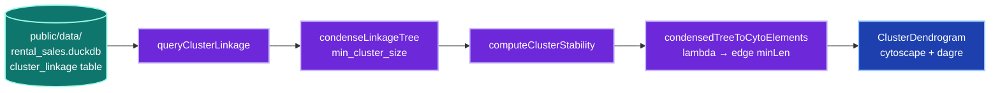

# HDBSCAN Condensed Dendrogram — Recreated in Cytoscape

How the project recreates HDBSCAN's condensed-tree icicle visualisation
using Cytoscape.js + cytoscape-dagre, instead of (or alongside) the raw
single-linkage tree we already persist in `cluster_linkage`.

## Why this matters

Our current `<ClusterDendrogram>` renders the *full* single-linkage tree
— every binary merge becomes a node, ~1,500 nodes for SAL. That tree is
faithful to the raw scipy linkage matrix HDBSCAN exposes via
`single_linkage_tree_`, but it ignores the two transformations that
make HDBSCAN's own dendrogram readable to an analyst:

1. **Condensation** — collapse every "shedding" merge (where one side
   has < `min_cluster_size` points) into the parent. What remains is a
   tree of *real splits*, typically 1–2 orders of magnitude smaller
   than the binary tree.
2. **λ axis** — plot vertical position by `λ = 1 / distance`, so dense
   clusters that persist across a wide density range become tall bars
   and noise pops out at the top.

This spec defines the maths, the dual-density architecture, and the
Cytoscape rendering contract.

## The maths in three layers

```
points ──core_k──> mutual reachability ──MST──> binary linkage
                                                       │
                                                       ▼
                                          condensation (min_cluster_size)
                                                       │
                                                       ▼
                                            condensed tree + λ values
                                                       │
                                                       ▼
                                            cluster stability S(C)
                                                       │
                                                       ▼
                                       icicle / dendrogram visualisation
```

### 1. Core + mutual reachability distance

For each point `x` and a chosen `k = min_samples`:

```
core_k(x)  = distance to the k-th nearest neighbour of x
d_mreach-k(a, b) = max{ core_k(a), core_k(b), d(a, b) }
```

This inflates distances in sparse regions while leaving dense-region
distances untouched.

### 2. MST → binary single-linkage tree

Take the MST of the mutual-reachability graph. Sort its N-1 edges
ascending; iteratively union the endpoints. Result is a scipy-style
linkage matrix `Z[i] = (left_id, right_id, distance, size)` — exactly
what `hdbscan` exposes via `clusterer.single_linkage_tree_.to_numpy()`,
and exactly what our ETL persists in `cluster_linkage` today (with
`is_leaf = false` for interior merges).

### 3. Condensation

Walk the binary tree from the root. At each internal merge node ask:
do *both* child subtrees contain ≥ `min_cluster_size` points?

| Both children ≥ min | Outcome |
|---|---|
| **Yes** | *True split* — emit two new condensed-tree children rooted at this merge. |
| **No**  | *Shedding* — the small side's points "fall out" of the parent at this λ; the large side inherits the parent's cluster id. The parent shrinks but does not split. |

Output: condensed tree, typically with `O(C × log N)` nodes where C is
the number of stable clusters. Reference implementation:
[`hdbscan._hdbscan_tree.condense_tree`](https://github.com/scikit-learn-contrib/hdbscan/blob/master/hdbscan/_hdbscan_tree.pyx).

### 4. λ = 1 / distance

For every condensed-tree event we record `λ = 1 / distance`. Why λ
rather than distance?

- **Density semantics** — λ is "inverse radius"; high λ = dense.
- **Stability is a clean integral** — `S(C) = Σ_{p ∈ C} (λ_p − λ_birth(C))`.
- **Boundedness** — distance can go to infinity; λ rests at zero for
  the root, finite-positive for everything else.

### 5. Cluster stability (excess of mass)

```
S(C) = Σ_{p ∈ C} ( λ_p(C) − λ_birth(C) )
```

where `λ_p(C)` is the λ at which point `p` left cluster `C` (either by
falling out through shedding or because `C` split and `p` moved to a
child). Geometrically: the *area* of `C`'s bar in the icicle plot.

The flat-cluster selection (EOM / FOSC) walks the condensed tree
bottom-up: for each internal cluster, if the sum of children's
stabilities exceeds the cluster's own, propagate the children up;
otherwise mark this cluster as the selected flat cluster and unmark
descendants. Output: a maximal antichain of clusters that jointly
maximise total stability.

## Architecture



*Caption: high-level pipeline. ETL persists the raw binary tree; the
frontend does condensation + λ scaling + layout. Keeps the bake fast
and lets the analyst tune `min_cluster_size` without a re-bake. VCS: 5 ✅*

<details>
<summary>📋 Detailed architecture (12 nodes)</summary>

```mermaid
flowchart TB
    subgraph etl["ETL (Python)"]
        pts["polygon centroids<br/>(lat, lon)"]:::compute
        hd["HDBSCAN<br/>min_samples=1"]:::compute
        slt["single_linkage_tree_<br/>(N−1, 4)"]:::compute
        ddb[("cluster_linkage<br/>(tier, method,<br/>node_id, parent_id,<br/>size, distance,<br/>is_leaf)")]:::data
        pts --> hd --> slt --> ddb
    end

    subgraph fe["Frontend (TypeScript)"]
        q[queryClusterLinkage]:::compute
        c[condenseLinkageTree<br/>min_cluster_size]:::compute
        l["compute λ = 1 / distance<br/>per node"]:::compute
        s[computeClusterStability<br/>S(C) = Σ(λ_p − λ_birth)]:::compute
        sel[selectFlatClusters<br/>EOM bottom-up]:::compute
        el[condensedTreeToCytoElements<br/>edge.minLen ∝ Δλ<br/>node.width ∝ size_at_birth]:::compute
        cy[Cytoscape + cytoscape-dagre<br/>rankDir TB · rankSep small<br/>so minLen resolves Δλ]:::ingress
        ui[ClusterDendrogram component<br/>min_cluster_size slider]:::ingress
    end

    ddb --> q --> c --> l --> s --> sel --> el --> cy --> ui

    classDef data       fill:#0f766e,stroke:#99f6e4,color:#fff,stroke-width:2px
    classDef compute    fill:#6d28d9,stroke:#c4b5fd,color:#fff,stroke-width:2px
    classDef ingress    fill:#1e40af,stroke:#93c5fd,color:#fff,stroke-width:2px
```

*Caption: detailed pipeline. The ETL stays unchanged — every
condensation parameter is client-side, so the analyst can flip
min_cluster_size without re-baking. VCS: 14 ✅*

</details>

## Visualisation contract (what the analyst sees)

| Axis / channel | Encodes | Why |
|---|---|---|
| **Vertical position** | λ (1 / merge distance) | Tall = stable cluster (wide density range); short = transient. |
| **Edge length (parent → child)** | `λ_child − λ_parent` via dagre `minLen` | Long edge = cluster persisted across many density levels before splitting. |
| **Node width** | Cluster size at birth (flattened polygons) | Wide = cluster dominates the population; narrow = niche. |
| **Edge stroke width** | Same as node width of child | Visually traces "polygon throughput" down the tree. |
| **Node fill** | Cluster stability `S(C)` mapped to a `viridis`-ish ramp | Bright = high stability → likely a "real" flat cluster. |
| **Border emphasis** | EOM-selected flat clusters | Matches `hdbscan`'s `select_clusters=True`. |

## Cytoscape mapping decisions

- **Layout** = `cytoscape-dagre` with `rankDir: 'TB'`, `rankSep: 10`
  (fine resolution so per-edge `minLen` differences translate to visible
  pixel gaps). `nodeSep` stays moderate (8 px) to avoid horizontal
  crowding.
- **Edge `minLen`** = `Math.max(1, Math.round((λ_child − λ_parent) × λ_pixel_scale))`.
  `λ_pixel_scale` is chosen so the largest `Δλ` resolves to ~40-60
  rank units (i.e. the tallest bar takes about half the canvas).
- **Node size** = `sizeToNodeRadius(size_at_birth, max_size)`,
  reusing the existing helper from `src/lib/cluster-dendrogram.ts`.
- **Node fill** = stability mapped via `mapData()` from a low-stability
  slate to a high-stability indigo so colour-blind viewers still get a
  luminance ramp.
- **Selected flat clusters** = border 3 px instead of 1 px; tooltip
  shows "EOM-selected".

## Out of scope (deferred)

- **Per-merge shedding events as bar-narrowing polygons.** True icicle
  bars require canvas/SVG custom rendering — Cytoscape's dagre + rect
  shape can only show a constant-width trunk per cluster. The
  user-facing benefit of bar narrowing is small for our typical 2-3
  member clusters; revisit if the analyst surfaces it.
- **Empirical cut-line slider.** HDBSCAN's `select_clusters` is the
  principled flat-cluster answer; a manual cut would only useful for
  comparing alternative cut depths. Defer until requested.
- **EVoC condensed equivalent.** EVoC's `cluster_tree_` is already
  n-ary and "condensed in spirit" — the same renderer can take it
  with a different ingest path.
