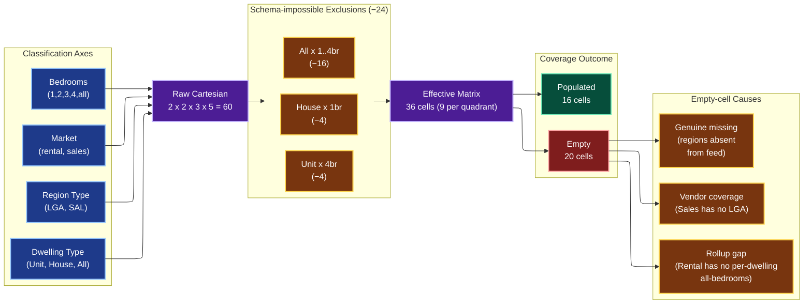

# Imputation Coverage Matrix

Audit of the `rental_sales` dataset against the full Cartesian product of its
four classification axes. The goal is to make data-coverage gaps explicit so
that imputation strategy can be designed per-cell, not as a blanket policy.

## Universe

| Axis | Values | Count |
|------|--------|-------|
| Market | Rental, Sales | 2 |
| Region Type | LGA, SAL | 2 |
| Dwelling Type | Unit, House, All | 3 |
| Bedrooms | 1, 2, 3, 4, all | 5 |
| **Cartesian product (raw)** | | 60 |
| Schema-impossible exclusions | | **−24** |
| · `(House, 1br)` per quadrant (4 cells) | | |
| · `(Unit, 4br)` per quadrant (4 cells) | | |
| · `(All, 1br..4br)` per quadrant (16 cells) | | |
| **Effective product** | | **36 cells** |

The vendor's source sheets pair bedroom counts to dwelling categories:

- `1br` is a **Unit-only** column.
- `4br` is a **House-only** column.
- `All-properties` is a **bedrooms = all** column — the vendor never publishes
  a per-bedroom slice of the all-dwellings aggregate. The `(All, all)` cell is
  the "All-properties" rollup we actually care about; `(All, 1br..4br)` are
  marginals that exist in no feed.

Region universe (Victoria-only — the geographies the front-end actually paints):

| Region Type | Vic universe (geometry file) | Observed in `rental_sales` |
|---|---|---|
| LGA (`lga_2024_aust_gda2020`) | 80 | 79 |
| SAL (`sal_2021_aust_gda2020`) | 2,946 | 901 |

The "Observed" column collapses every dwelling/bedroom slice into a single
distinct-region count — a region appears here if it has *any* row in the
parquet. Coverage drops sharply once we slice by dwelling type and bedrooms,
which is what the matrix below shows.

## Schema flow



## Headline coverage

| Slice | Populated cells | Empty cells | Datapoints |
|---|---:|---:|---:|
| Rental x LGA | 7 / 9 | 2 | 49,310 |
| Rental x SAL | 7 / 9 | 2 | 97,413 |
| Sales x LGA | 0 / 9 | 9 | 0 |
| Sales x SAL | 2 / 9 | 7 | 12,803 |
| **Total** | **16 / 36** | **20** | **159,526** |

The 20 remaining empty cells now sort cleanly into three causes:

- **Vendor coverage (9 cells)** — every `Sales × LGA` row. The vendor
  publishes sales only at the suburb tier; no LGA roll-up exists.
- **Rollup gap (10 cells)** — Sales ships only `bedrooms = all` per dwelling
  type, so every `Sales × SAL × * × {1,2,3,4}` is empty (7 cells); Rental
  never ships a per-dwelling all-bedrooms rollup, so `Rental × * ×
  {Unit,House} × all` is empty (4 cells); plus the `Sales × SAL × All ×
  all` cell which the vendor doesn't ship either.
- **Genuine missing region** — none of the 20 empty cells fall here at the
  matrix-cell granularity (they're either vendor or rollup gaps). Genuine
  missing regions show up *inside* a populated cell as a coverage % below
  100 — the "Coverage" column on each row flags those.

## Full Cartesian-product table (36 rows)

`Distinct Regions` is the count of unique geographies present in that cell.
`Datapoints` is the number of `(region, time_bucket)` median rows in the
parquet — i.e. the materialised observation count, excluding the duplicated
`count`-statistic rows that always shadow the rental median rows.

`Coverage` compares `Distinct Regions` against the Victorian region universe
for the row's region type (LGA = 80, SAL = 2,946). Populated cells with low
coverage are where imputation can plausibly help.

### Rental x LGA (9 rows)

| Market | Region Type | Dwelling | Bedrooms | Distinct Regions | Datapoints | Coverage vs Vic LGA (80) |
|---|---|---|---|---:|---:|---|
| Rental | LGA | Unit | 1 | 71 | 5,802 | 88.8% |
| Rental | LGA | Unit | 2 | 75 | 7,237 | 93.8% |
| Rental | LGA | Unit | 3 | 68 | 5,361 | 85.0% |
| Rental | LGA | Unit | all | 0 | 0 | rollup gap |
| Rental | LGA | House | 2 | 79 | 7,326 | 98.8% |
| Rental | LGA | House | 3 | 79 | 8,163 | 98.8% |
| Rental | LGA | House | 4 | 78 | 7,087 | 97.5% |
| Rental | LGA | House | all | 0 | 0 | rollup gap |
| Rental | LGA | All | all | 79 | 8,334 | 98.8% |

### Rental x SAL (9 rows)

| Market | Region Type | Dwelling | Bedrooms | Distinct Regions | Datapoints | Coverage vs Vic SAL (2,946) |
|---|---|---|---|---:|---:|---|
| Rental | SAL | Unit | 1 | 139 | 13,181 | 4.7% |
| Rental | SAL | Unit | 2 | 140 | 14,279 | 4.8% |
| Rental | SAL | Unit | 3 | 139 | 13,665 | 4.7% |
| Rental | SAL | Unit | all | 0 | 0 | rollup gap |
| Rental | SAL | House | 2 | 138 | 13,857 | 4.7% |
| Rental | SAL | House | 3 | 138 | 14,198 | 4.7% |
| Rental | SAL | House | 4 | 138 | 13,820 | 4.7% |
| Rental | SAL | House | all | 0 | 0 | rollup gap |
| Rental | SAL | All | all | 140 | 14,413 | 4.8% |

### Sales x LGA (9 rows — all empty: no Sales-at-LGA feed)

| Market | Region Type | Dwelling | Bedrooms | Distinct Regions | Datapoints | Coverage vs Vic LGA (80) |
|---|---|---|---|---:|---:|---|
| Sales | LGA | Unit | 1 | 0 | 0 | vendor gap |
| Sales | LGA | Unit | 2 | 0 | 0 | vendor gap |
| Sales | LGA | Unit | 3 | 0 | 0 | vendor gap |
| Sales | LGA | Unit | all | 0 | 0 | vendor gap |
| Sales | LGA | House | 2 | 0 | 0 | vendor gap |
| Sales | LGA | House | 3 | 0 | 0 | vendor gap |
| Sales | LGA | House | 4 | 0 | 0 | vendor gap |
| Sales | LGA | House | all | 0 | 0 | vendor gap |
| Sales | LGA | All | all | 0 | 0 | vendor gap |

### Sales x SAL (9 rows)

| Market | Region Type | Dwelling | Bedrooms | Distinct Regions | Datapoints | Coverage vs Vic SAL (2,946) |
|---|---|---|---|---:|---:|---|
| Sales | SAL | Unit | 1 | 0 | 0 | rollup gap |
| Sales | SAL | Unit | 2 | 0 | 0 | rollup gap |
| Sales | SAL | Unit | 3 | 0 | 0 | rollup gap |
| Sales | SAL | Unit | all | 421 | 4,626 | 14.3% |
| Sales | SAL | House | 2 | 0 | 0 | rollup gap |
| Sales | SAL | House | 3 | 0 | 0 | rollup gap |
| Sales | SAL | House | 4 | 0 | 0 | rollup gap |
| Sales | SAL | House | all | 747 | 8,177 | 25.4% |
| Sales | SAL | All | all | 0 | 0 | rollup gap |

## Where imputation can actually help

The 16 populated cells split into two clean tiers:

| Cell tier | Examples | Coverage shape | Imputation lever |
|---|---|---|---|
| **High-coverage LGA** | Rental LGA House 2/3/4br, Rental LGA Unit 1/2/3br, Rental LGA All-Properties | 68-79 of 80 Vic LGAs | Single-region backfill at most; not really an "impute" problem |
| **Sparse SAL** | Rental SAL Unit 1/2/3br, Rental SAL House 2/3/4br, Rental SAL All-Properties, Sales SAL House-all, Sales SAL Unit-all | 138-747 of 2,946 Vic SALs (5%-25%) | Real imputation target — interpolate from neighbouring SALs / LGA roll-ups |

**Empty cells** fall into three buckets — the table column `Coverage` flags
which one:

- **Vendor gap** (`vendor gap`): vendor publishes this dimension at another
  region tier but not this one. Imputation can synthesise it from the
  available tier. All 9 `Sales × LGA` cells are here — derivable by
  population-weighted roll-up from `Sales × SAL`.
- **Rollup gap** (`rollup gap`): the row is a marginal the vendor never
  publishes. Sales only ships `bedrooms = all`; Rental never ships
  `(per-dwelling, bedrooms=all)`. Imputation here is a row-level
  *aggregation*, not interpolation — sum the children to produce the
  parent. Both `Rental × {Unit,House} × all` and `Sales × {Unit,House} ×
  {2,3,4}br` are recoverable this way; only the asymmetry of direction
  changes.
- **Genuine missing region**: the cell exists in the feed but a specific
  SAL/LGA isn't present. Coverage % under 100 flags this. Textbook
  imputation case — borrow from neighbours.

## Reproducing this table

The numbers above are produced by the following DuckDB query against
`data/converted/rental_sales.parquet`. Filters:

- `statistic = 'median'` de-duplicates the rental rows (rental ships paired
  `count`/`median` columns per quarter, so without the filter every datapoint
  is double-counted).
- `dwelling_type <> 'vacant_land'` removes the Land axis-value.
- `bedrooms <> '0'` removes the bedrooms=0 axis-value.
- Three axis-builder predicates strip the schema-impossible cells
  `(house, 1br)`, `(unit, 4br)`, and `(all, 1..4br)` from the Cartesian
  product itself, so they don't appear as 0-row empties in the output.

```sql
WITH axes AS (
    SELECT
        dt.data_type, gt.geospatial_type, dw.dwelling_type, br.bedrooms
    FROM (VALUES ('rental'), ('sales')) dt(data_type)
    CROSS JOIN (VALUES ('lga'), ('suburb')) gt(geospatial_type)
    CROSS JOIN (VALUES ('unit'), ('house'), ('all')) dw(dwelling_type)
    CROSS JOIN (VALUES ('1'), ('2'), ('3'),
                       ('4'), ('all')) br(bedrooms)
    WHERE NOT (dw.dwelling_type = 'house' AND br.bedrooms = '1')
      AND NOT (dw.dwelling_type = 'unit'  AND br.bedrooms = '4')
      AND NOT (dw.dwelling_type = 'all'   AND br.bedrooms IN ('1','2','3','4'))
),
data AS (
    SELECT
        data_type, geospatial_type, dwelling_type, bedrooms,
        count(DISTINCT geospatial) AS distinct_regions,
        count(*)                   AS datapoints
    FROM 'data/converted/rental_sales.parquet'
    WHERE statistic = 'median'
      AND dwelling_type <> 'vacant_land'
      AND bedrooms      <> '0'
    GROUP BY 1, 2, 3, 4
)
SELECT
    axes.*,
    coalesce(data.distinct_regions, 0) AS distinct_regions,
    coalesce(data.datapoints,       0) AS datapoints
FROM axes
LEFT JOIN data USING (data_type, geospatial_type, dwelling_type, bedrooms)
ORDER BY 1, 2, 3, 4;
```
